---
## Author
author:
  name: Седохин Даниил Алексеевич
  degrees: DSc
  orcid: 0000-0002-0877-7063
  email: 1132231845@pfur.ru
  affiliation:
    - name: Российский университет дружбы народов
      country: Российская Федерация
      postal-code: 117198
      city: Москва
      address: ул. Миклухо-Маклая, д. 6

## Title
title: "Отчёт по лабораторной работе 5"
subtitle: "Конфигурирование VLAN"
license: "CC BY"
---

# Цель работы

Получить основные навыки по настройке VLAN на коммутаторах сети.

# Задание

Нам необходимо настроить Trunk порты на соответствующих интерфейсах всех коммутаторов.
Ниже настройка коммутатора msk-donskaya-dasedokhin-sw-1
([рис. @fig-001]).

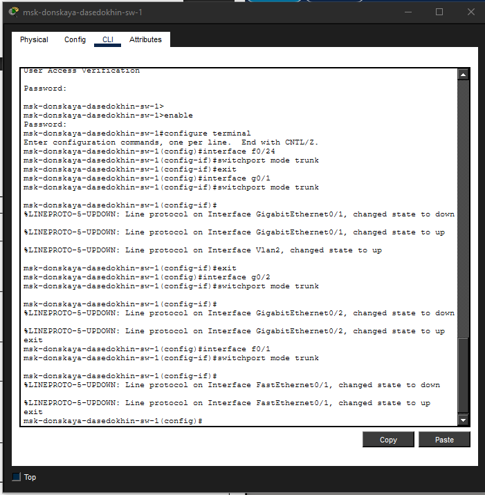{#fig-001 width=70%}

Настройка Trunk-порта коммутатора msk-donskaya-dasedokhin-sw-2
([рис. @fig-002]).

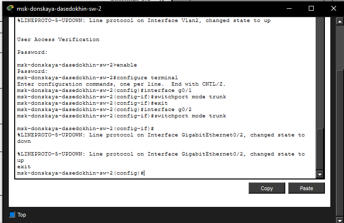{#fig-002 width=70%}

Настройка Trunk-порта коммутатора msk-donskaya-dasedokhin-sw-3
([рис. @fig-003]).

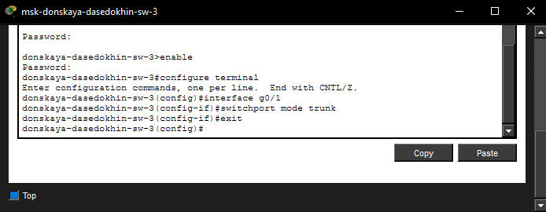{#fig-003 width=70%}

Настройка Trunk-порта коммутатора msk-donskaya-dasedokhin-sw-4
([рис. @fig-004]).

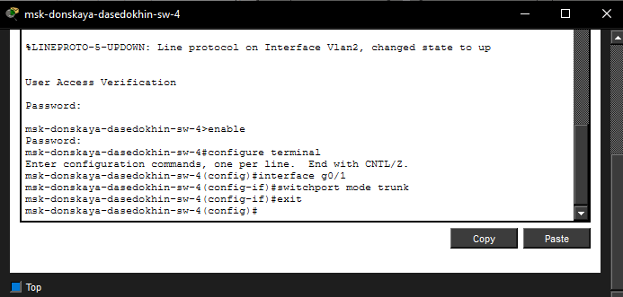{#fig-004 width=70%}

Настройка Trunk-порта коммутатора msk-pavlovskaya-dasedokhin-sw-1
([рис. @fig-005]).

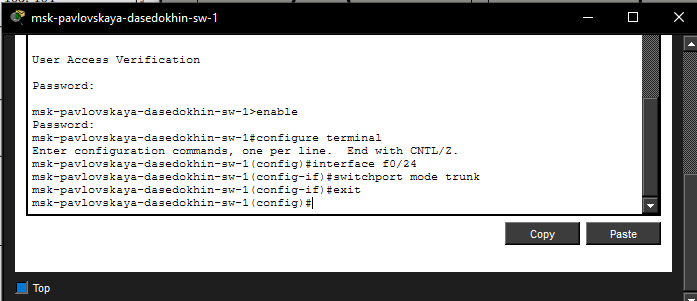{#fig-005 width=70%}

Настроим коммутатор msk-donskaya-sw-1 как VTP-сервер и пропишем на нём номера и названия VLAN
([рис. @fig-006]).

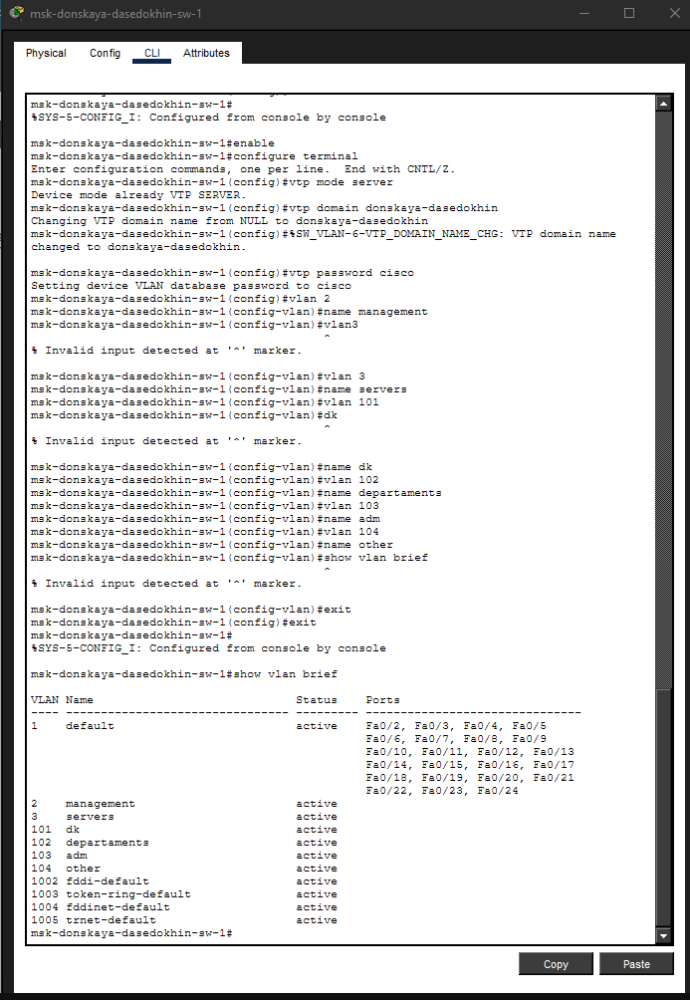{#fig-006 width=70%}

Настроим коммутаторы msk-donskaya-sw-2 — mskdonskaya-sw-4, msk-pavlovskaya-sw-1 как VTP-клиенты 
([рис. @fig-007]).

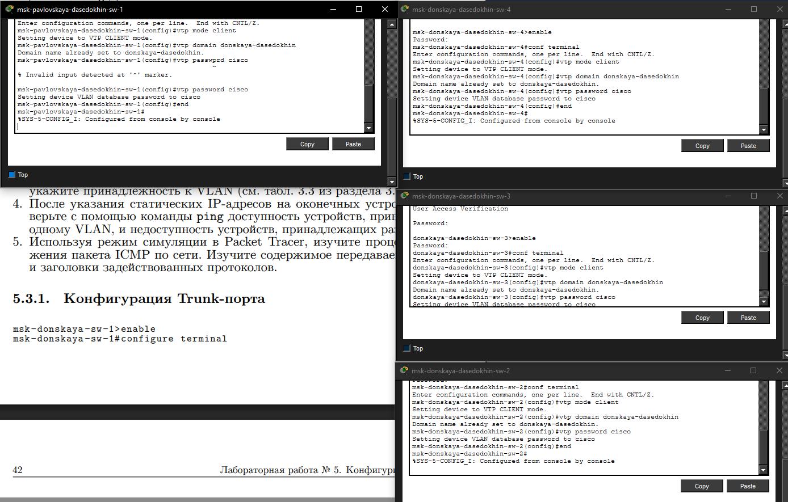{#fig-007 width=70%}

Теперь на интерфейсах укажем принадлежность к VLAN
([рис. @fig-008]).

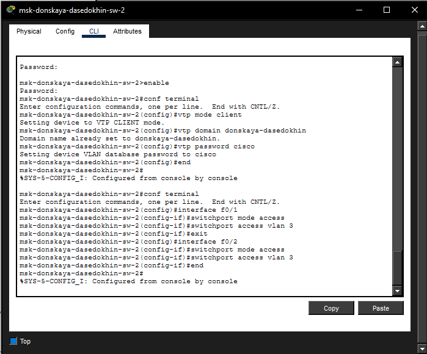{#fig-008 width=70%}

Принадлежность к VLAN для msk-donskaya-dasedokhin-sw-3
([рис. @fig-009]).

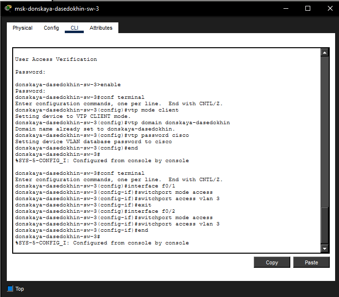{#fig-009 width=70%}

Принадлежность к VLAN для msk-donskaya-dasedokhin-sw-4
([рис. @fig-010]).

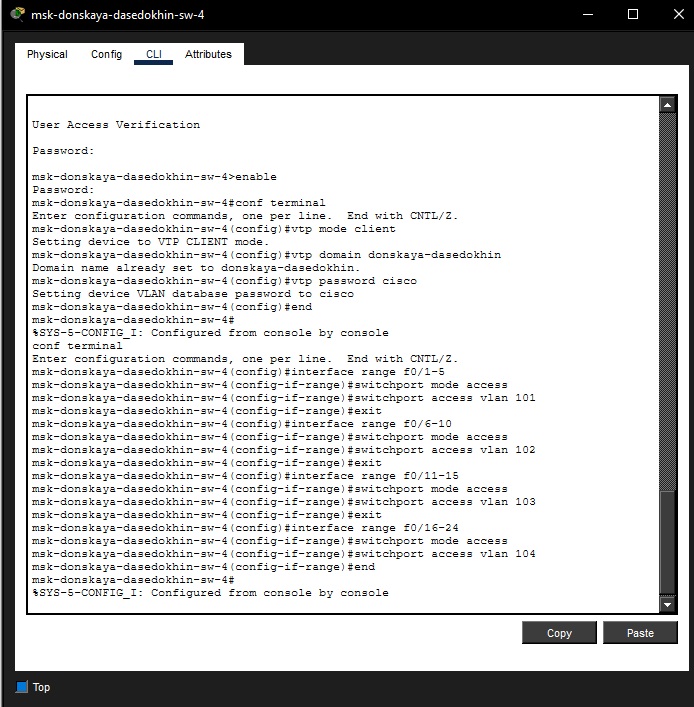{#fig-010 width=70%}

Принадлежность к VLAN для msk-pavlovskaya-dasedokhin-sw-1
([рис. @fig-011]).

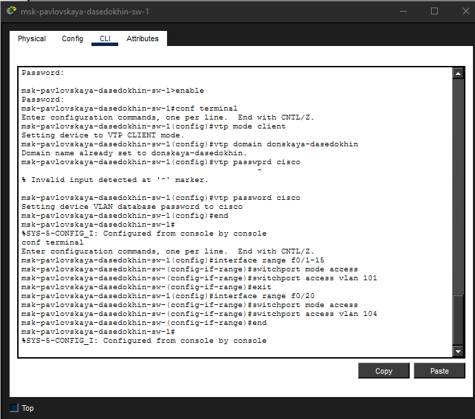{#fig-011 width=70%}

Теперь укажем ститические IP-адреса для оконечных устройств.
([рис. @fig-012]).

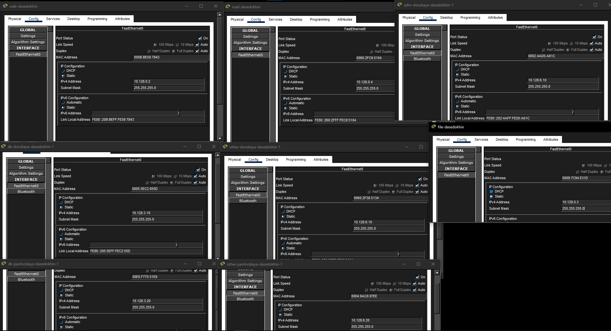{#fig-012 width=70%}

Теперь попробуем пропинговать оконечные устройства принадлежащие одному VLAN.
([рис. @fig-013]).

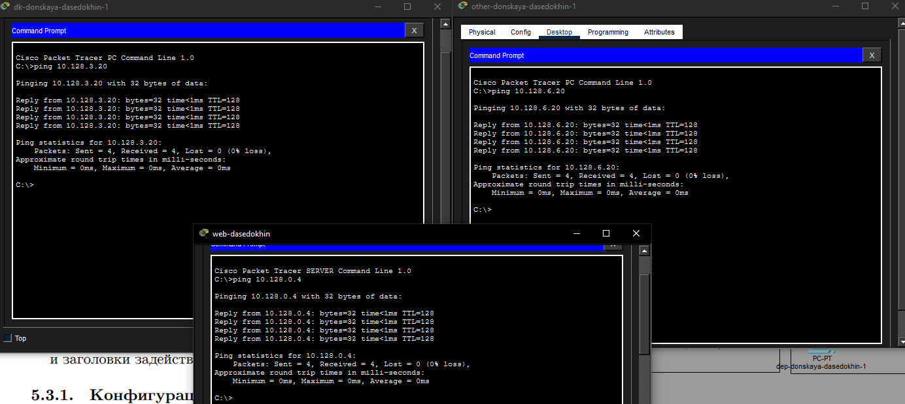{#fig-013 width=70%}

Теперь пропингуем устройства принадлежащие разным VLAN
([рис. @fig-014]).

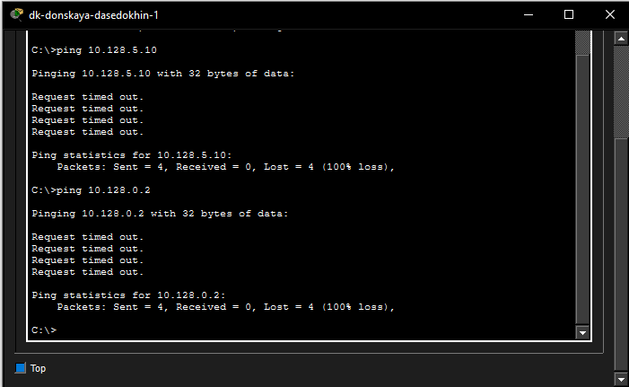{#fig-014 width=70%}

Используя режим симуляции в Packet Tracer, изучим процесс передвижения пакета ICMP по сети. 
([рис. @fig-015]).

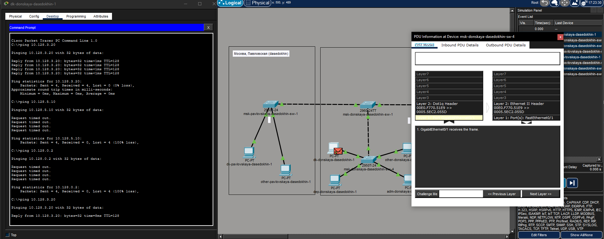{#fig-015idth=70%}

# Контрольные вопросы

1. Какая команда используется для просмотра списка VLAN на сетевом устройстве?

Для просмотра списка VLAN на коммутаторе Cisco используется команда show vlan brief. Она отображает все созданные VLAN, их статус и порты, назначенные в каждый VLAN. Также можно использовать команду show vlan для более детальной информации.

2. Охарактеризуйте VLAN Trunking Protocol (VTP). Приведите перечень команд с пояснениями для настройки и просмотра информации о VLAN.

VTP (VLAN Trunking Protocol) — это проприетарный протокол Cisco, предназначенный для централизованного управления VLAN в сети. Он
позволяет синхронизировать информацию о VLAN (номера, имена) между всеми коммутаторами в одном домене. Существует три режима работы: Server (создание и рассылка VLAN), Client (прием информации от сервера) и Transparent (локальное управление без участия в VTP).

Команды настройки VTP:

vtp mode server — переводит коммутатор в режим сервера

vtp mode client — переводит коммутатор в режим клиента

vtp domain название — задает имя VTP-домена

vtp password пароль — устанавливает пароль для домена

vtp version 2 — выбирает версию протокола

Команды создания VLAN (на сервере):

vlan номер — создает VLAN с указанным номером

name имя — присваивает имя созданному VLAN

Команды просмотра:

show vtp status — отображает статус VTP (режим, домен, версию)

show vlan brief — показывает список VLAN

3. Охарактеризуйте Internet Control Message Protocol (ICMP). Опишите формат пакета ICMP.

ICMP (Internet Control Message Protocol) — это протокол сетевого уровня, используемый для передачи диагностической информации и сообщений об ошибках. Он лежит в основе таких утилит, как ping (использует ICMP Echo Request и Echo Reply) и traceroute.

Формат пакета ICMP состоит из следующих полей:

Тип (1 байт) — определяет тип сообщения (0 = Echo Reply, 8 = Echo Request, 3 = Destination Unreachable, 11 = Time Exceeded)

Код (1 байт) — уточняет тип сообщения

Контрольная сумма (2 байта) — для проверки целостности

Идентификатор (2 байта) — для сопоставления запросов и ответов

Номер последовательности (2 байта) — нумерация пакетов

Данные — произвольная информация (обычно временные метки)

4. Охарактеризуйте Address Resolution Protocol (ARP). Опишите формат пакета ARP.

ARP (Address Resolution Protocol) — это протокол канального уровня, предназначенный для определения MAC-адреса по известному IP-адресу в локальной сети. Когда устройству нужно отправить данные другому устройству, оно сначала отправляет широковещательный ARP-запрос, а устройство с нужным IP отвечает своим MAC-адресом.

Формат пакета ARP включает следующие поля:

Тип оборудования (2 байта) — указывает тип сети (1 для Ethernet)

Тип протокола (2 байта) — указывает протокол (0x0800 для IPv4)

Длина аппаратного адреса (1 байт) — для Ethernet равна 6 байтам

Длина протокольного адреса (1 байт) — для IPv4 равна 4 байтам

Код операции (2 байта) — 1 для запроса, 2 для ответа

MAC-адрес отправителя (6 байт)

IP-адрес отправителя (4 байта)

MAC-адрес получателя (6 байт) — в запросе заполнен нулями

IP-адрес получателя (4 байта)

5. Что такое MAC-адрес? Какова его структура?

MAC-адрес (Media Access Control address) — это уникальный аппаратный идентификатор, присваиваемый сетевому интерфейсу на заводе-изготовителе. Он работает на канальном уровне модели OSI и используется для доставки кадров в пределах одной локальной сети.

Структура MAC-адреса (48 бит или 6 байт):

Первые 3 байта (24 бита) — OUI (Organizationally Unique Identifier), идентификатор производителя оборудования

Последние 3 байта (24 бита) — уникальный номер, присваиваемый производителем конкретному устройству

Пример MAC-адреса: 00:1A:2B:3C:4D:5E

Первый байт MAC-адреса содержит два важных бита:

Младший бит (I/G) — указывает тип адреса: 0 для индивидуального (unicast), 1 для группового (multicast)

Второй бит (U/L) — указывает способ управления: 0 для глобально уникального (зарегистрированного), 1 для локально администрируемого

Существует также специальный широковещательный MAC-адрес: FF:FF:FF:FF:FF:FF, который используется для отправки кадров всем устройствам в сети.

# Выводы

Я Получил основные навыки по настройке VLAN на коммутаторах сети.
