---
## Author
author:
  name: Седохин Даниил Алексеевич
  degrees: DSc
  orcid: 0000-0002-0877-7063
  email: 1132231845@pfur.ru
  affiliation:
    - name: Российский университет дружбы народов
      country: Российская Федерация
      postal-code: 117198
      city: Москва
      address: ул. Миклухо-Маклая, д. 6

## Title
title: "Отчёт по лабораторной работе 7"
subtitle: "Учёт физических параметров сети"
license: "CC BY"
---

# Цель работы

Получить навыки работы с физической рабочей областью Packet Tracer, а также учесть физические параметры сети.

# Задание

Откройте проект предыдущей лабораторной работы
([рис. @fig-001]).

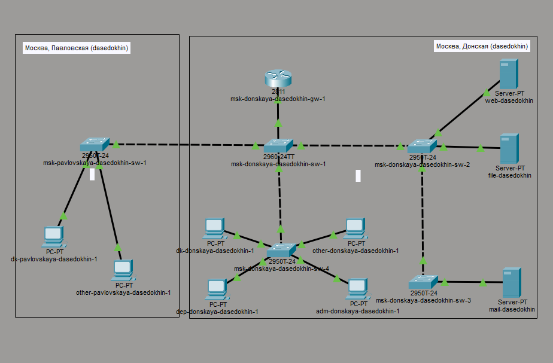{#fig-001 width=70%}

Перейдите в физическую рабочую область Packet Tracer. Присвойте название городу — Moscow
Присвойте ему название Donskaya. Добавьте здание для территории
Pavlovskaya.
([рис. @fig-002]).

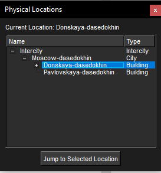{#fig-002 width=70%}

Щёлкнув на изображении здания Donskaya, переместите изображение, обозначающее серверное помещение, в него.
([рис. @fig-003]).

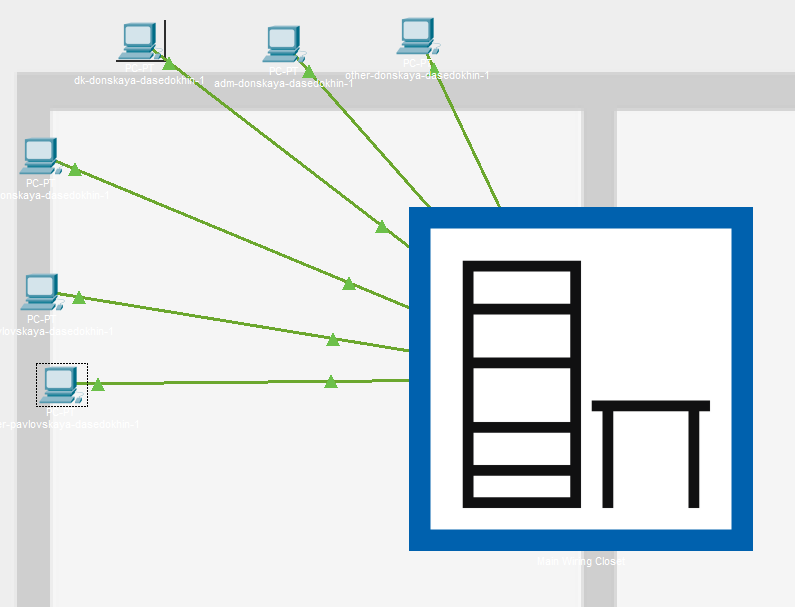{#fig-003 width=70%}

Переместите коммутатор msk-pavlovskaya-sw-1 и два оконечных устройства dk-pavlovskaya-1 и other-pavlovskaya-1 на территорию Pavlovskaya,
используя меню Move физической рабочей области Packet Tracer.
([рис. @fig-004]).

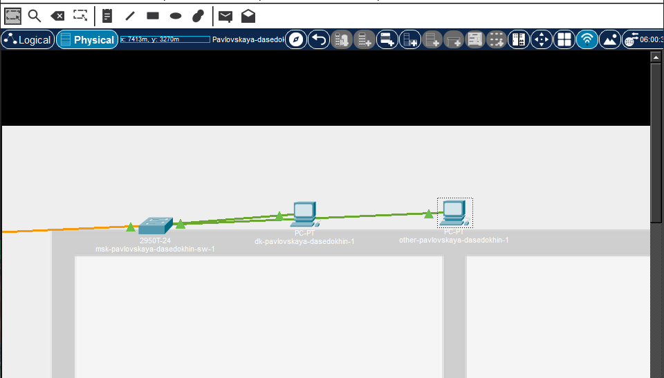{#fig-004 width=70%}

Вернувшись в логическую рабочую область Packet Tracer, пропингуйте с коммутатора msk-donskaya-sw-1 коммутатор msk-pavlovskaya-sw-1.
Убедитесь в работоспособности соединения
([рис. @fig-005]).

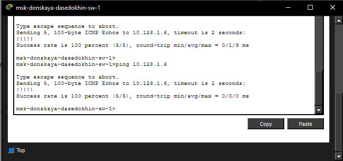{#fig-005 width=70%}

В меню Options , Preferences во вкладке Interface активируйте разрешение
на учёт физических характеристик среды передачи (Enable Cable Length
Effects).
([рис. @fig-006]).

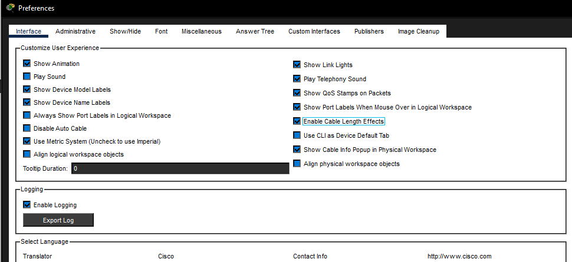{#fig-006 width=70%}

В физической рабочей области Packet Tracer разместите две территории на
расстоянии более 100 м друг от друга (рекомендуемое расстояние — около
1000 м или более).
([рис. @fig-007]).

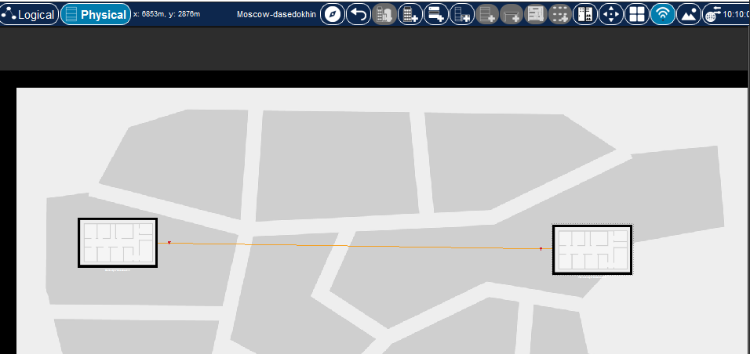{#fig-007 width=70%}

Вернувшись в логическую рабочую область Packet Tracer, пропингуйте с коммутатора msk-donskaya-sw-1 коммутатор msk-pavlovskaya-sw-1.
Убедитесь в неработоспособности соединения.
([рис. @fig-008]).

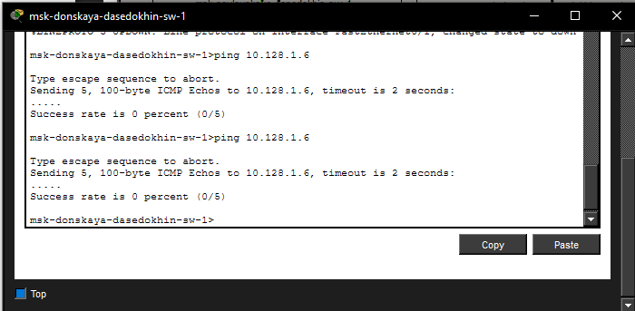{#fig-008 width=70%}

Удалите соединение между msk-donskaya-sw-1 и msk-pavlovskaya-sw-1.
Добавьте в логическую рабочую область два повторителя (RepeaterPT). Присвойте им соответствующие названия msk-donskaya-mc-1
и msk-pavlovskaya-mc-1. Замените имеющиеся модули на PT-REPEATERNM-1FFE и PT-REPEATER-NM-1CFE для подключения оптоволокна
и витой пары по технологии Fast Ethernet
([рис. @fig-009]).

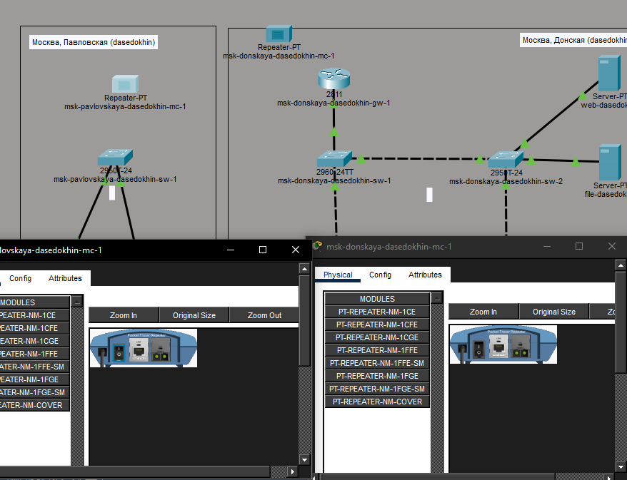{#fig-009 width=70%}

Переместите msk-pavlovskaya-mc-1 на территорию Pavlovskaya (в физической рабочей области Packet Tracer).
([рис. @fig-010]).

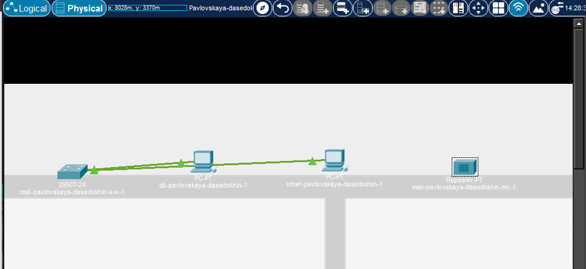{#fig-010 width=70%}

Подключите коммутатор msk-donskaya-sw-1 к msk-donskaya-mc-1 по витой паре, msk-donskaya-mc-1 и msk-pavlovskaya-mc-1 — по оптоволокну,
msk-pavlovskaya-sw-1 к msk-pavlovskaya-mc-1 — по витой паре 
([рис. @fig-011]).

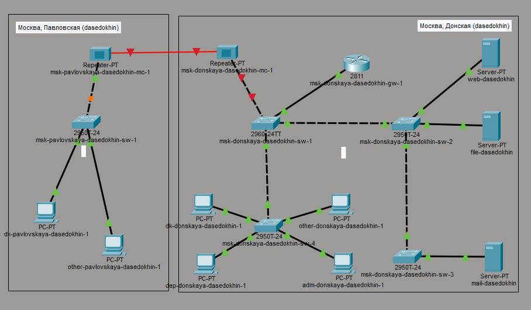{#fig-011 width=70%}

Убедитесь в работоспособности соединения между msk-donskaya-sw-1
и msk-pavlovskaya-sw-1.
([рис. @fig-012]).

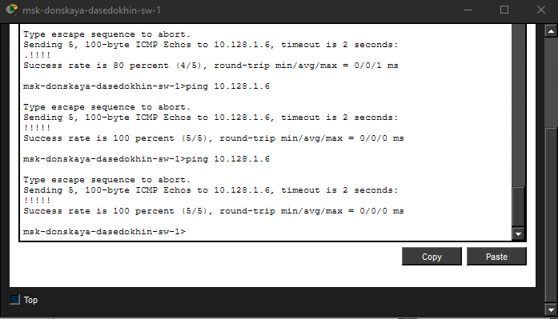{#fig-012
width=70%}

# Контрольные вопросы

1. Перечислите возможные среды передачи данных. На какие характеристики среды передачи данных следует обращать внимание при планировании сети?
Возможные среды передачи данных:

Витая пара (Twisted Pair): неэкранированная (UTP) и экранированная (STP, FTP).

Оптоволоконный кабель (Fiber Optic): одномодовое (SMF) и многомодовое (MMF) волокно.

Коаксиальный кабель (Coaxial): в настоящее время в локальных сетях используется редко.

Беспроводная среда (Wireless): радиоканалы стандартов Wi-Fi, Bluetooth, сотовая связь, спутниковая связь.

Характеристики, на которые следует обращать внимание при планировании сети:

Максимальная длина сегмента: расстояние, на котором сигнал сохраняет целостность без использования повторителей (репитеров) или медиаконвертеров.

Пропускная способность (скорость передачи данных): максимальная скорость, которую поддерживает среда (например, 100 Мбит/с, 1 Гбит/с, 10 Гбит/с).

Помехозащищенность: устойчивость к электромагнитным помехам (EMI) и радиочастотным помехам (RFI).

Затухание сигнала: потеря мощности сигнала по мере распространения по кабелю.

Стоимость: как самого кабеля, так и монтажных работ и активного оборудования (трансиверов, разъемов).

Условия прокладки: возможность прокладки на открытом воздухе, в земле, в кабельных каналах, устойчивость к перепадам температур и влажности.

2. Перечислите категории витой пары. Чем они отличаются? Какая категория в каких условиях может применяться?
Основные категории витой пары (UTP/STP):

Cat 5e (Category 5 enhanced):

Отличия: частота 100 МГц.

Применение: обеспечивает скорость до 1 Гбит/с (Gigabit Ethernet) на расстоянии до 100 м. Наиболее распространенная категория для офисных и домашних сетей начального уровня.

Cat 6 (Category 6):

Отличия: частота 250 МГц, имеет более плотную скрутку жил и часто разделительный пластиковый сердечник (spline) для уменьшения перекрестных помех.

Применение: обеспечивает скорость до 1 Гбит/с на расстоянии до 100 м, и до 10 Гбит/с на расстоянии до 55 м. Используется в высокоскоростных офисных и дата-центрах.

Cat 6a (Category 6 augmented):

Отличия: частота 500 МГц, усиленная защита от внешних и внутренних перекрестных помех.

Применение: обеспечивает скорость до 10 Гбит/с на полном расстоянии до 100 м. Используется в высоконагруженных сетях, где требуется полная гарантия пропускной способности на больших расстояниях.

Cat 7 (Category 7):

Отличия: частота до 600 МГц, обязательно наличие индивидуального экрана для каждой пары и общего экрана (экранированная витая пара — S/FTP).

Применение: используется в дата-центрах и серверных с высоким уровнем электромагнитных помех. Требует специальных разъемов (GG45 или TERA) или обжима под RJ45 с заземлением.

Cat 8 (Category 8):

Отличия: частота до 2000 МГц (2 ГГц).

Применение: предназначена для дата-центров. Обеспечивает скорость 25/40 Гбит/с, но на ограниченное расстояние (обычно до 30 м). Не используется для горизонтальной подсистемы (рабочих мест) из-за жестких требований к длине и стоимости.

3. В чем отличие одномодового и многомодового оптоволокна? Какой тип кабеля в каких условиях может применяться?
Отличия:

Многомодовое оптоволокно (MMF — Multi-Mode Fiber):

Диаметр сердцевины: больше (50 или 62,5 мкм).

Характер распространения: свет распространяется по множеству лучей (мод), отражаясь от границ сердцевины. Это приводит к модовой дисперсии (размытию импульса).

Источник света: обычно используются более дешевые VCSEL (лазеры с вертикальным резонатором) или светодиоды (LED).

Дальность: эффективна на относительно небольших расстояниях (до 300–550 м для 10 Гбит/с, до 2 км для старых стандартов 100 Мбит/с).

Стоимость: само волокно дешевле, но трансиверы работают на более коротких волнах (850 нм).

Одномодовое оптоволокно (SMF — Single-Mode Fiber):

Диаметр сердцевины: очень маленький (8–10 мкм).

Характер распространения: свет распространяется по одному лучу (одна мода). Дисперсия практически отсутствует.

Источник света: используются дорогие
лазерные диоды, работающие на длинах волн 1310 нм или 1550 нм.

Дальность: позволяет передавать данные на десятки и сотни километров без регенерации сигнала.

Стоимость: само волокно дороже, а трансиверы значительно дороже многомодовых, но позволяют строить магистрали большой протяженности.

Условия применения:

Многомодовое (MMF): применяется внутри зданий, кампусов, в серверных (внутри дата-центров), между этажами, где расстояния не превышают нескольких сотен метров. Оптимально для локальных сетей (LAN) с бюджетными ограничениями.

Одномодовое (SMF): применяется для связи между зданиями (на расстояниях более 300–500 м), на магистралях провайдеров, в городских сетях (MAN), а также для подключения удаленных филиалов (WAN). Используется там, где требуется максимальная дальность связи без использования повторителей.

4. Какие разъёмы встречаются на патчах оптоволокна? Чем они отличаются?
На патчах оптоволокна встречаются следующие типы разъемов (коннекторов):

SC (Subscriber Connector / Standard Connector):

Отличия: прямоугольный разъем с фиксацией по принципу "push-pull" (задвинул — зафиксировалось). Имеет квадратное сечение. Обычно используется в дуплексном варианте (два разъема, скрепленных клипсой — «двойной SC»).

Особенность: простой и надежный, широко распространен в оборудовании уровня провайдеров и корпоративных сетях (SFP-модули, патч-панели).

LC (Lucent Connector):

Отличия: по сути, это уменьшенная версия SC (SFF — Small Form Factor). Имеет квадратный пластиковый корпус с защелкой, напоминающей телефонный разъем (RJ).

Особенность: занимает меньше места на лицевой панели оборудования. Наиболее распространен в современных коммутаторах, SFP/SFP+ трансиверах и плотных кроссовых панелях. Часто используется в дуплексных парах.

FC (Ferrule Connector):

Отличия: круглый металлический разъем с накидной гайкой (резьбовое соединение).

Особенность: обеспечивает очень надежную фиксацию, защищен от вибраций и случайного отсоединения. Используется преимущественно в агрессивных условиях, на магистральных линиях связи, в телекоммуникационных шкафах наружной установки, где важна жесткая фиксация.

ST (Straight Tip):

Отличия: круглый разъем с байонетным замком (push-pull с поворотом, как у коаксиальных разъемов BNC).

Особенность: устаревающий тип. Широко использовался в многомодовых сетях (например, в старых версиях 10BASE-FL). В современном оборудовании встречается редко из-за неудобства работы в высокоплотных средах и высокой вероятности перекоса при соединении.

MTP/MPO (Multi-fiber Push On):

Отличия: многожильный разъем, объединяющий в одном корпусе от 8 до 24 волокон (чаще всего 12 или 24).

Особенность: используется для высокоплотных соединений, в дата-центрах для подключения трансиверов QSFP (40G, 100G и выше), а также для структурированных кабельных систем предварительной оконцовки.

# Выводы

Я получиЛ навыки работы с физической рабочей областью Packet Tracer,
а также учёл физические параметры сети.
