---
## Author
author:
  name: Седохин Даниил Алексеевич
  degrees: DSc
  orcid: 0000-0002-0877-7063
  email: 1132231845@pfur.ru
  affiliation:
    - name: Российский университет дружбы народов
      country: Российская Федерация
      postal-code: 117198
      city: Москва
      address: ул. Миклухо-Маклая, д. 6

## Title
title: "Отчёт по лабораторной работе 9"
subtitle: "Использование протокола STP. Агрегирование каналов"
license: "CC BY"
---

# Цель работы

Изучение возможностей протокола STP и его модификаций по обеспечению
отказоустойчивости сети, агрегированию интерфейсов и перераспределению
нагрузки между ними.

# Задание

 Сформируйте резервное соединение между коммутаторами msk-donskayasw-1 и msk-donskaya-sw-3 (рис. 9.1). Для этого:

– замените соединение между коммутаторами msk-donskaya-sw-1

(Gig0/2) и msk-donskaya-sw-4 (Gig0/1) на соединение между коммутаторами msk-donskaya-sw-1 

(Gig0/2) и msk-donskaya-sw-3 (Gig0/2);

– сделайте порт на интерфейсе Gig0/2 коммутатора msk-donskaya-sw-3
транковым:

msk−donskaya −sw −3(config)#int g0/2
msk−donskaya −sw −3(config −if)#switchport mode trunk

– соединение между коммутаторами msk-donskaya-sw-1 и msk-donskayasw-4 сделайте через интерфейсы Fa0/23, не забыв активировать их
в транковом режиме.
([рис. @fig-001]).

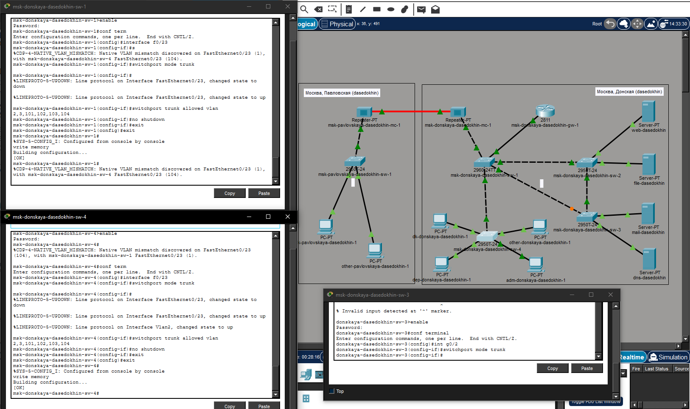{#fig-001 width=70%}

С оконечного устройства dk-donskaya-1 пропингуйте серверы mail и web.
([рис. @fig-002]).

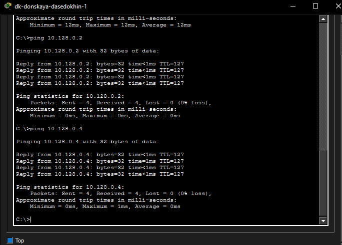{#fig-002 width=70%}

В режиме симуляции проследите движение пакетов ICMP. Убедитесь, что
движение пакетов происходит через коммутатор msk-donskaya-sw-2
([рис. @fig-003]).

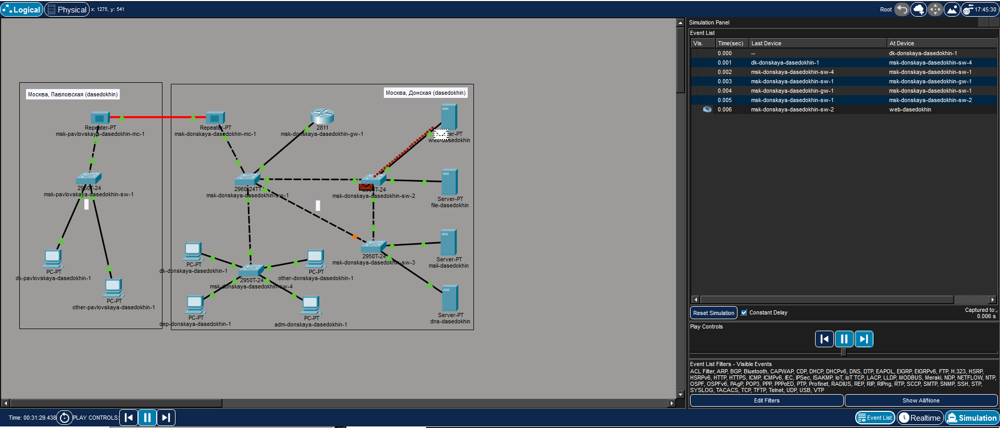{#fig-003 width=70%}

Просмотр движения ICMP пакетов до web
([рис. @fig-004]).

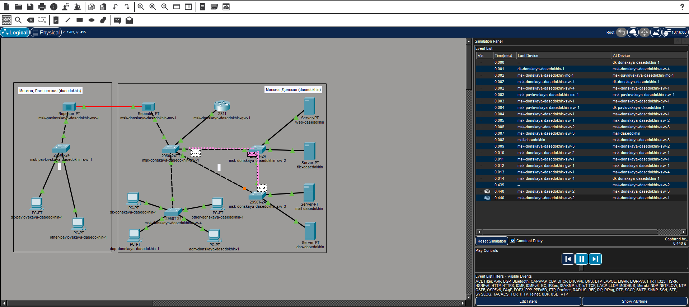{#fig-004 width=70%}

На коммутаторе msk-donskaya-sw-2 посмотрите состояние протокола STP
для vlan 3:

msk−donskaya −sw −2#show spanning −tree vlan 3
([рис. @fig-005]).

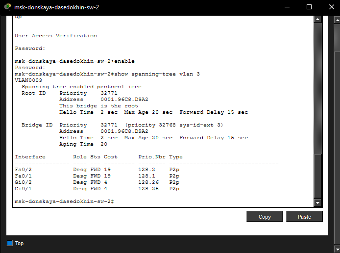{#fig-005 width=70%}

В качестве корневого коммутатора STP настройте коммутатор mskdonskaya-sw-1:

msk−donskaya −sw −1#configure terminal

msk−donskaya −sw −1(config)#spanning −tree vlan 3 root primary
([рис. @fig-006]).

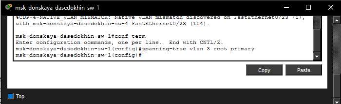{#fig-006 width=70%}

Используя режим симуляции, убедитесь, что пакеты ICMP пойдут от
хоста dk-donskaya-1 до mail через коммутаторы msk-donskaya-sw-1 и mskdonskaya-sw-3
([рис. @fig-007]).

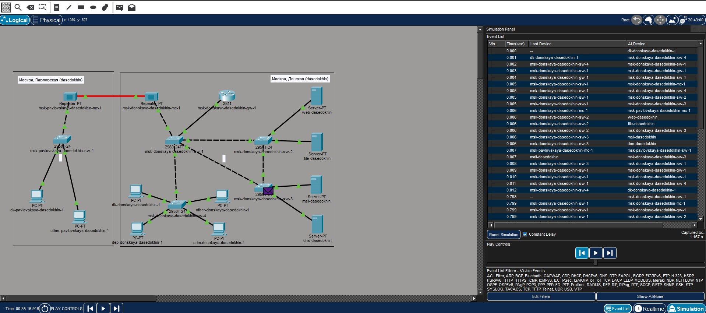{#fig-007 width=70%}

а от хоста dk-donskaya-1 до web через коммутаторы
msk-donskaya-sw-1 и msk-donskaya-sw-2.
([рис. @fig-008]).

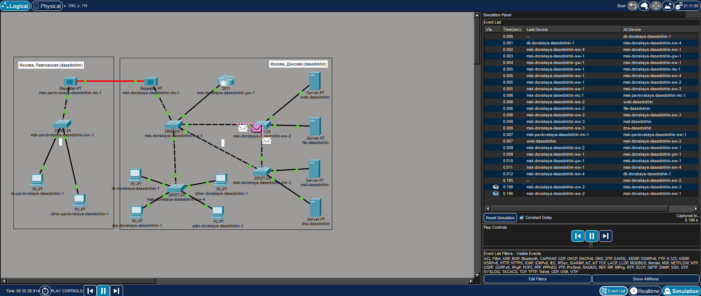{#fig-008 width=70%}

Настройте режим Portfast на тех интерфейсах коммутаторов, к которым
подключены серверы:

msk−donskaya −sw −2(config)#interface f0/1

msk−donskaya −sw −2(config −if)#spanning −tree portfast

msk−donskaya −sw −2(config)#interface f0/2

msk−donskaya −sw −2(config −if)#spanning −tree portfast

msk−donskaya −sw −3(config)#interface f0/1

msk−donskaya −sw −3(config −if)#spanning −tree portfast

msk−donskaya −sw −3(config)#interface f0/2

msk−donskaya −sw −3(config −if)#spanning −tree portfast
([рис. @fig-009]).

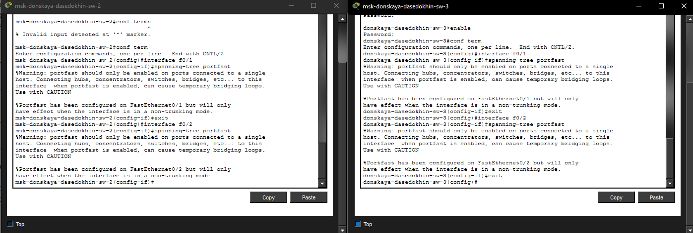{#fig-009 width=70%}

Изучите отказоустойчивость протокола STP и время восстановления соединения при переключении на резервное соединение. Для этого используйте
команду ping -n 1000 mail.donskaya.rudn.ru на хосте dk-donskaya-1,
а разрыв соединения обеспечьте переводом соответствующего интерфейса
коммутатора в состояние shutdown.
([рис. @fig-010]).

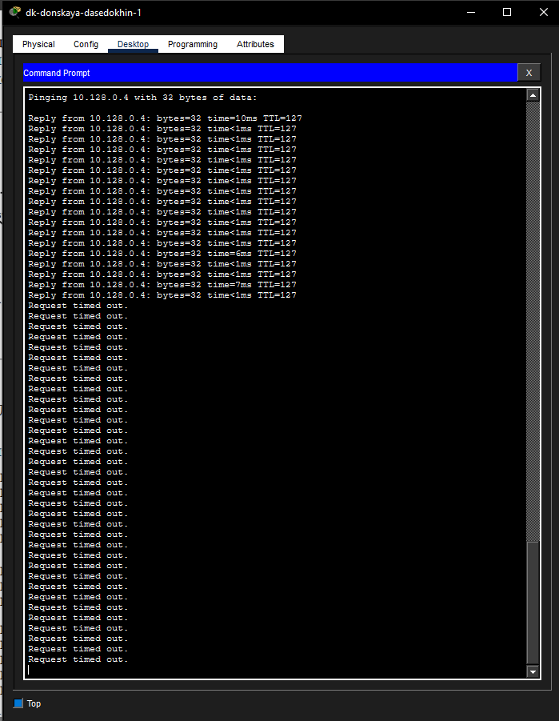{#fig-010 width=70%}

Переключите коммутаторы режим работы по протоколу Rapid PVST+:

msk−donskaya −sw −1(config)#spanning −tree mode rapid −pvst

msk−donskaya −sw
−2(config)#spanning −tree mode rapid −pvst

msk−donskaya −sw −3(config)#spanning −tree mode rapid −pvst

msk−donskaya −sw −4(config)#spanning −tree mode rapid −pvst

msk−pavlovskaya −sw −1(config)#spanning −tree mode rapid −pvst
([рис. @fig-011]).

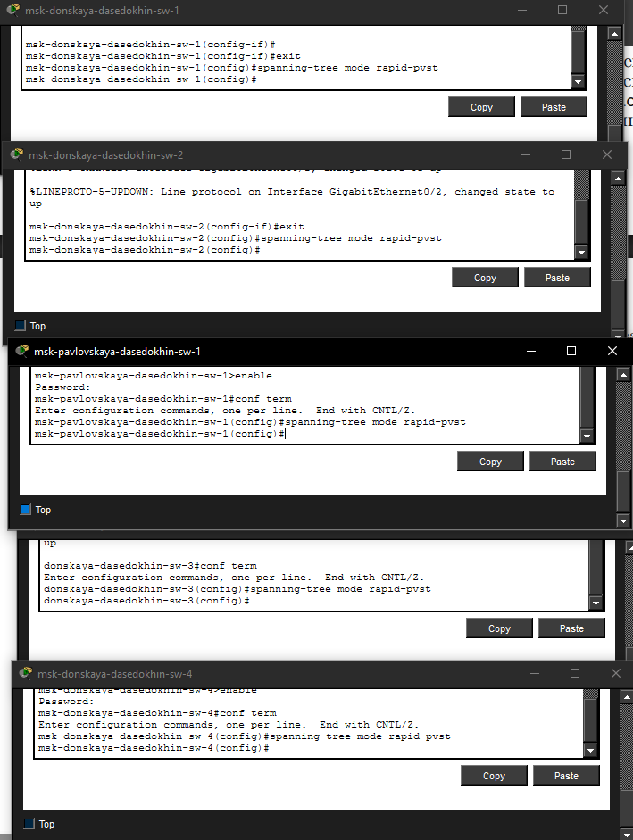{#fig-011 width=70%}

Изучите отказоустойчивость протокола Rapid PVST+ и время восстановления соединения при переключении на резервное соединение.
([рис. @fig-012]).

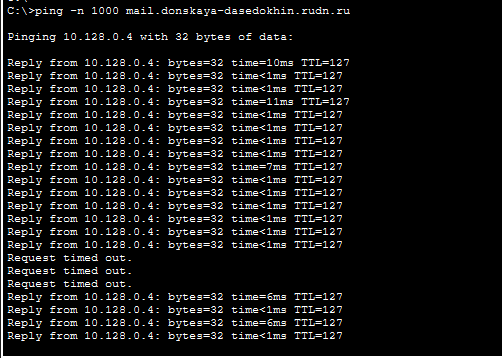{#fig-012 width=70%}

Сформируйте агрегированное соединение интерфейсов Fa0/20 – Fa0/23
между коммутаторами msk-donskaya-sw-1 и msk-donskaya-sw-4

Настройте агрегирование каналов (режим EtherChannel)
([рис. @fig-013]).

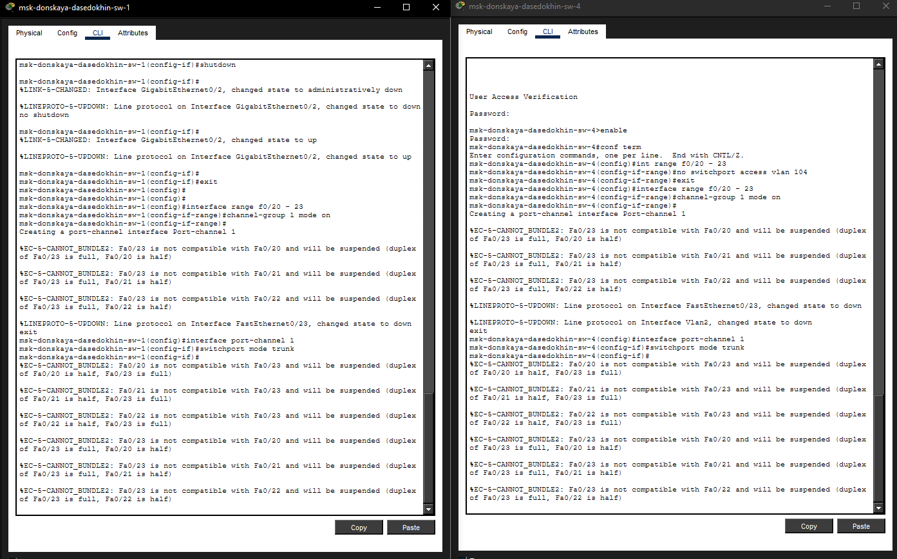{#fig-013 width=70%}

# Контрольные вопросы

Команда show spanning-tree vlan [номер] позволяет определить корневой коммутатор, роль и состояние каждого порта в указанном VLAN.

На корневом устройстве: This bridge is the root, все порты в роли Desg (Designated).
Пример:

Root ID Priority 24579, Address 000A.4139.23DA, This bridge is the root  
Interface Gi0/1 Role Desg Sts FWD  

Некорневое устройство: показывает Root ID (с адресом корня), свой Bridge ID, и порты с ролями Root, Altn, Desg.

Пример:

Root ID Priority 24579, Address 000A.4139.23DA, Cost 4, Port Gi0/1  
Interface Gi0/1 Role Root Sts FWD, Gi0/2 Role Altn Sts BLK  

Команда show spanning-tree vlan [номер] | include protocol или просто show spanning-tree показывает режим работы.

Для STP (802.1D): Spanning tree enabled protocol ieee

Для Rapid PVST+: Spanning tree enabled protocol rstp
Пример вывода:

VLAN0003 Spanning tree enabled protocol rstp
Portfast включается на портах, к которым подключены одиночные конечные устройства (серверы, ПК), чтобы они сразу переходили в состояние Forwarding, минуя стадии Listening и Learning. Это ускоряет подключение устройств и предотвращает тайм-ауты DHCP и приложений. Не используется на портах между коммутаторами во избежание петель.

Агрегированный интерфейс (EtherChannel) объединяет несколько физических портов в один логический канал. Принцип работы: трафик распределяется между физическими линками на основе хеша (MAC, IP, порты). Используется для увеличения пропускной способности и обеспечения отказоустойчивости (при выходе одного порта трафик идёт через остальные).

Отличия протоколов агрегации:

LACP (active/passive) — открытый стандарт (802.3ad), поддерживает обнаружение ошибок и автоматическое добавление/удаление портов.

PAgP (desirable/auto) — проприетарный протокол Cisco, аналогичен LACP по функционалу.

Статический режим (on) — без протокола обмена сообщениями, порты просто объединяются. Не проверяет совместимость на другом конце, может привести к петлям или ошибкам конфигурации.

Команды для проверки EtherChannel:

show etherchannel summary — краткий статус групп и портов.

show etherchannel port-channel — детали о Port-channel интерфейсах.

show interfaces port-channel [номер] trunk — информация о транке на логическом интерфейсе.

show running-config interface port-channel [номер] — конфигурация агрегированного канала.

# Выводы

Я изучил возможности  протокола STP и его модификаций по обеспечению
отказоустойчивости сети, агрегированию интерфейсов и перераспределению
нагрузки между ними.
