---
## Author
author:
  name: Седохин Даниил Алексеевич
  degrees: DSc
  orcid: 0000-0002-0877-7063
  email: 1132231845@pfur.ru
  affiliation:
    - name: Российский университет дружбы народов
      country: Российская Федерация
      postal-code: 117198
      city: Москва
      address: ул. Миклухо-Маклая, д. 6
## Title
title: "Презентация по лабораторной работе 10"
subtitle: "Настройка списков управления доступом (ACL)"
license: CC BY
date: today
date-format: "YYYY-MM-DD" # Example: 2025-09-06
---

# Информация

## Докладчик

:::::::::::::: {.columns align=center}
::: {.column width="70%"}

  * Седохин Даниил Алексеевич
  * Российский университет дружбы народов им. П. Лумумбы

:::
::: {.column width="30%"}

:::
::::::::::::::

# Вводная часть

## Цели и задачи

- Освоить настройку прав доступа пользователей к ресурсам сети.

# Выполнение заданий

## слайд 1

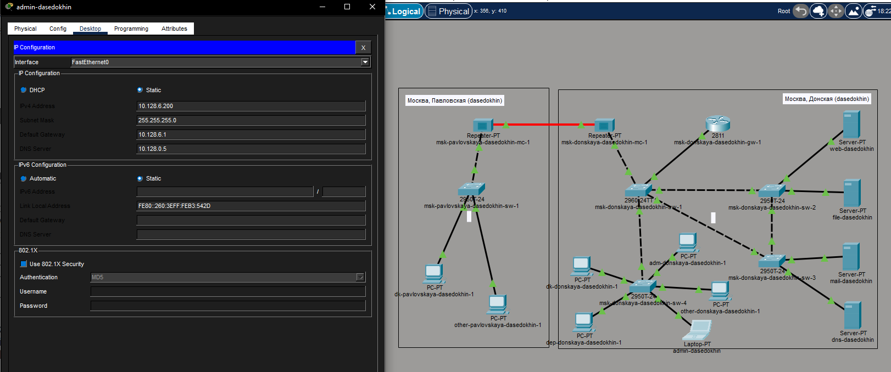

## слайд 2

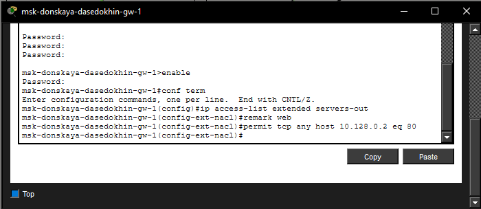

## слайд 3

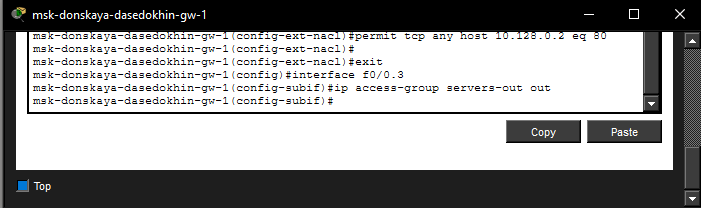

## слайд 4

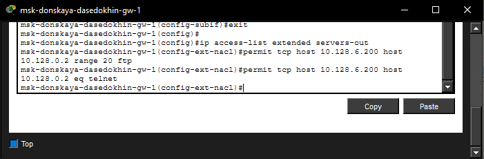

## слайд 5

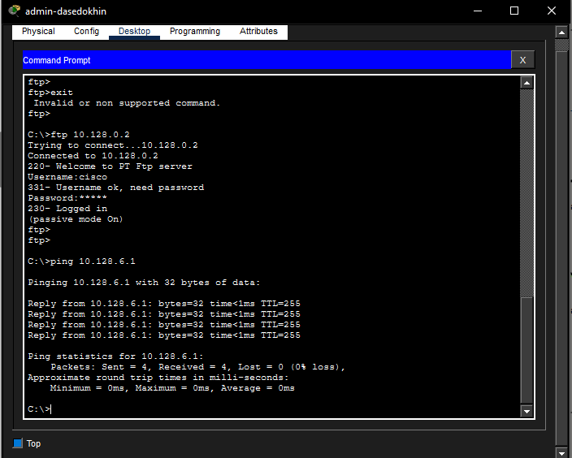

## слайд 6

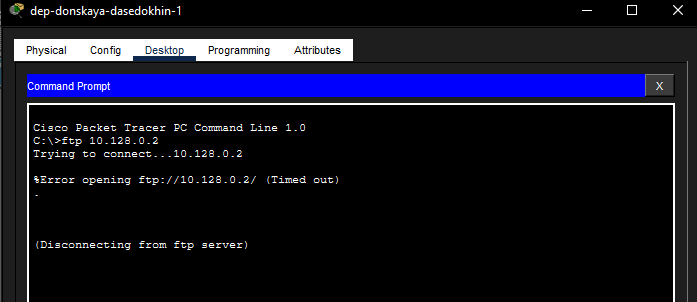

## слайд 7

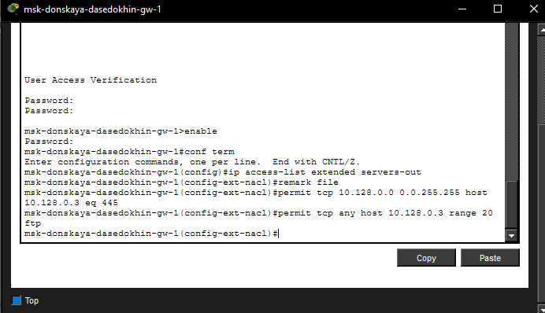

## слайд 8

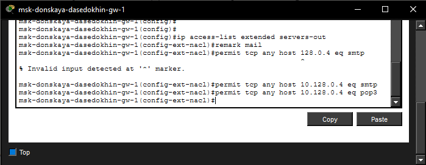

## слайд 9

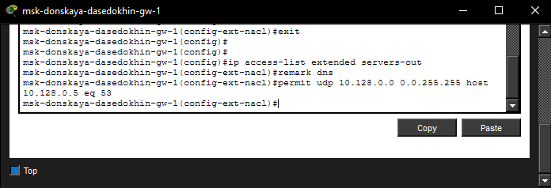

## слайд 10

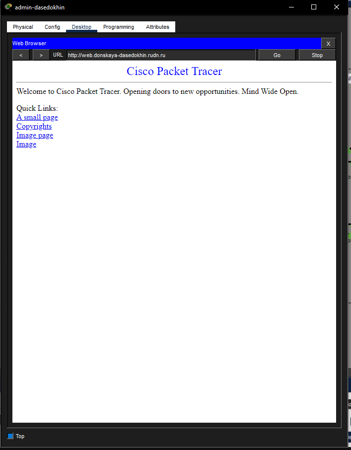

## слайд 11

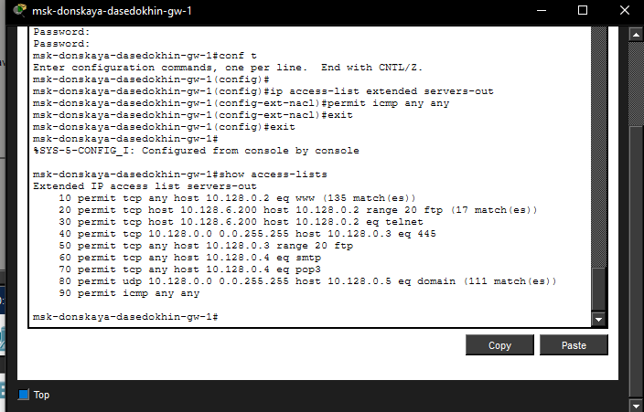

## слайд 12

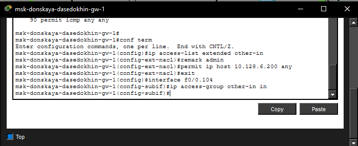

## слайд 13

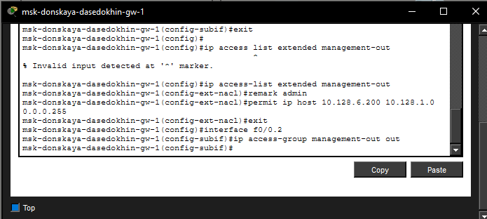

## слайд 14

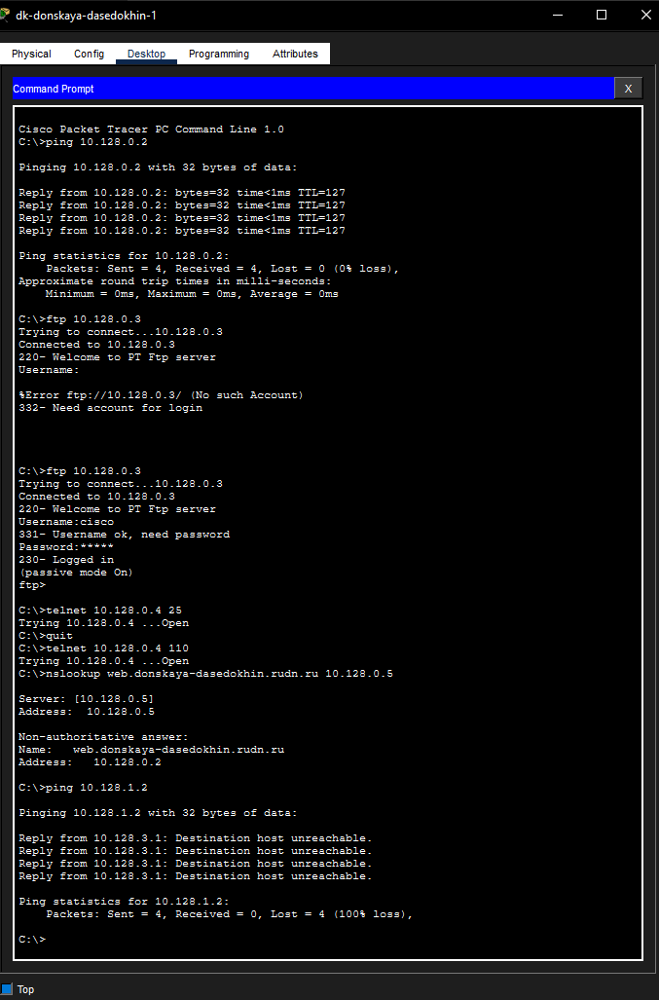

## слайд 15

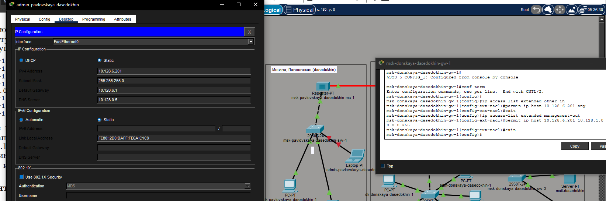

## слайд 16

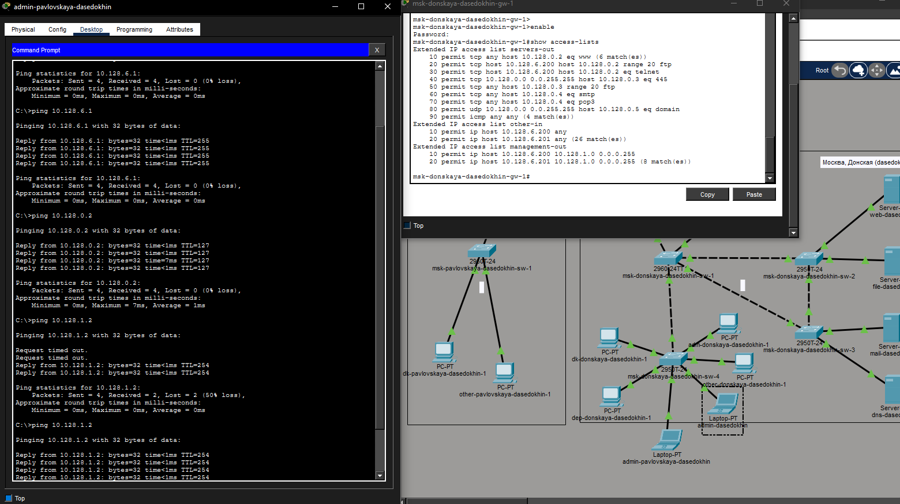

## слайд 17

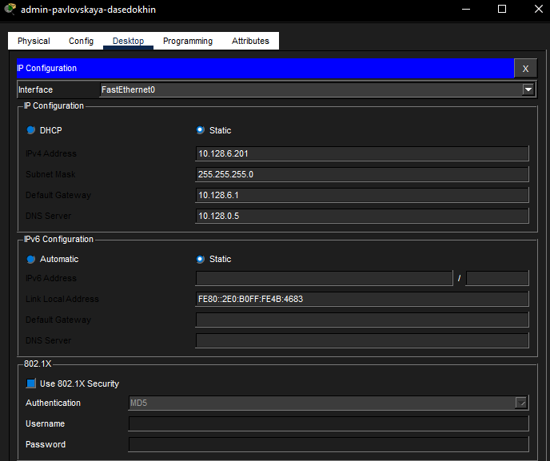

# Выводы

## слайд 1

Я освоил настройку прав доступа пользователей к ресурсам сети.
