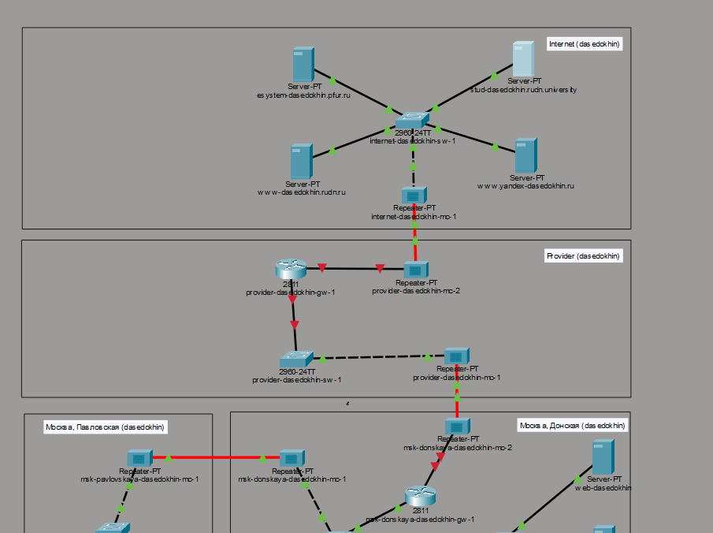
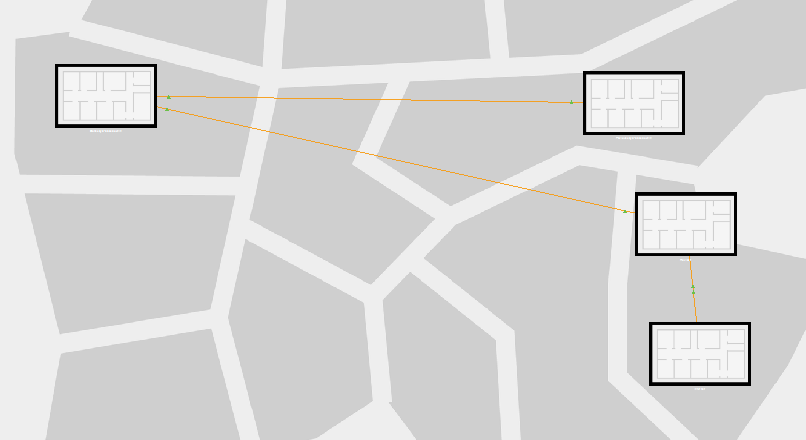
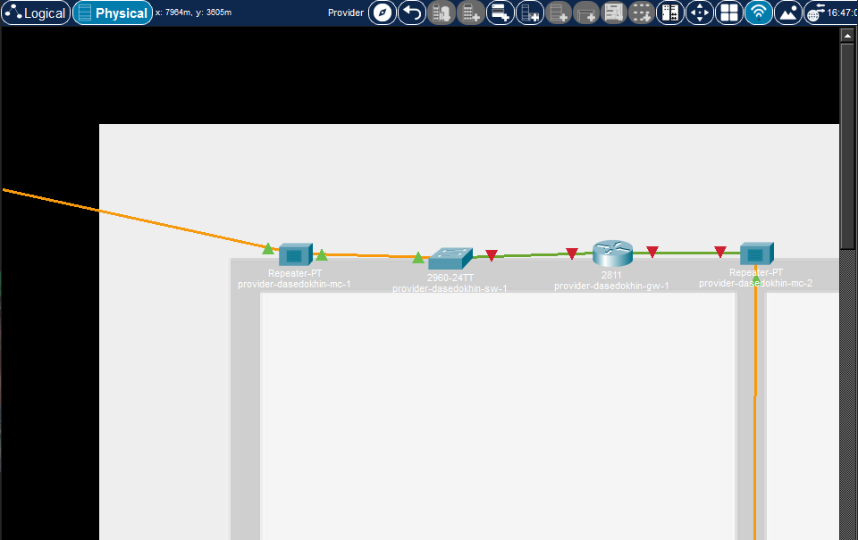
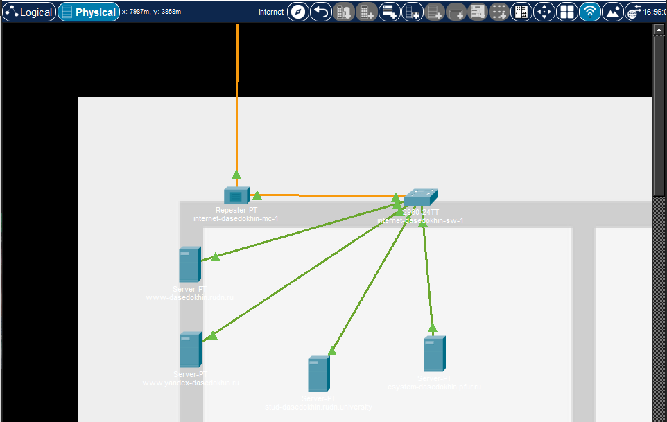
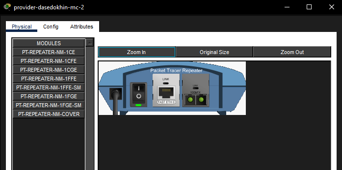
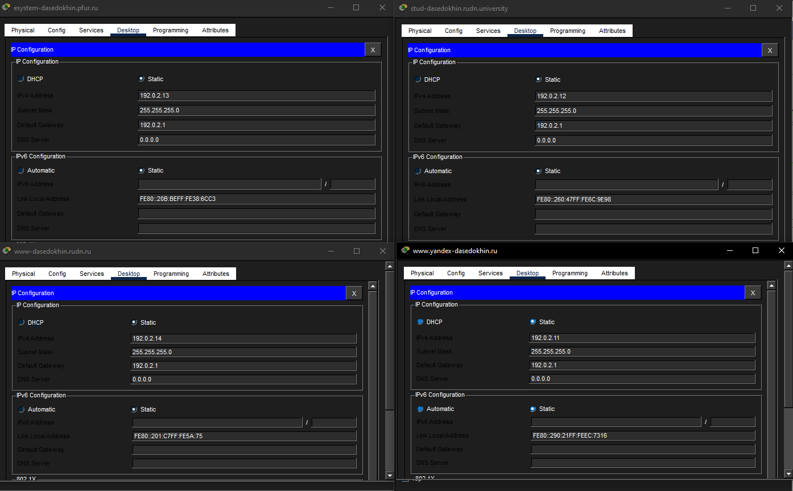
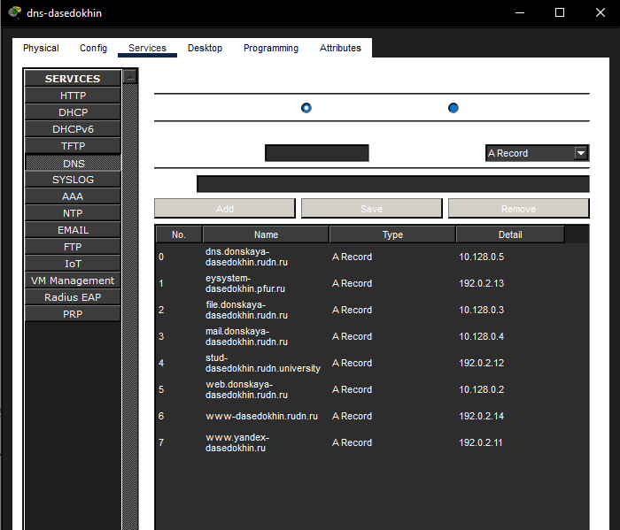
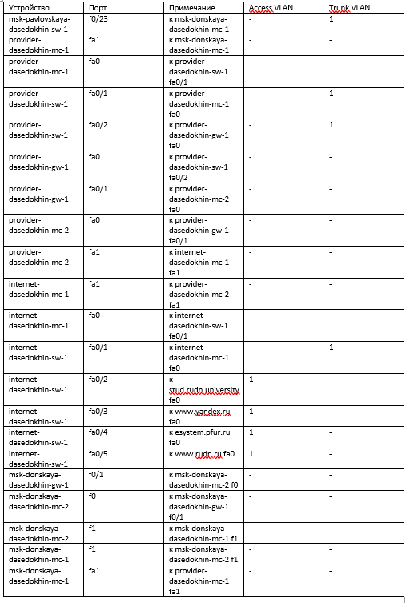
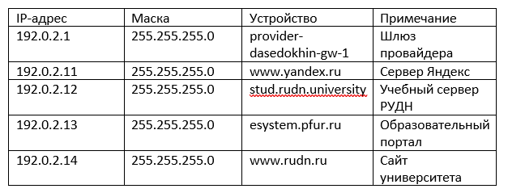

---
## Author
author:
  name: Седохин Даниил Алексеевич
  degrees: DSc
  orcid: 0000-0002-0877-7063
  email: 1132231845@pfur.ru
  affiliation:
    - name: Российский университет дружбы народов
      country: Российская Федерация
      postal-code: 117198
      city: Москва
      address: ул. Миклухо-Маклая, д. 6

## Title
title: "Отчёт по лабораторной работе 11"
subtitle: "Настройка NAT. Планирование"
license: "CC BY"
---

# Цель работы

Провести подготовительные мероприятия по подключению локальной сети
организации к Интернету.

# Задание

На схеме предыдущего проекта разместим новые устройства: 4 медиаконвертера (Repeater-PT), 2 коммутатора типа Cisco 2960-24TT,
маршрутизатор типа Cisco 2811, 4 сервера, соединим их.
([рис. @fig-001]).

{#fig-001 width=70%}

В физической рабочей области добавьте здание провайдера и здание,
имитирующее расположение серверов модельного Интернета 
([рис. @fig-002]).

{#fig-002 width=70%}

Перенесем оборудование из области донская в здание провайдера в физическом уровне проекта
([рис. @fig-003]).

{#fig-003 width=70%}

Перенесем оборудование из области донская в здание интернета в физическом уровне проекта
([рис. @fig-004]).

{#fig-004 width=70%}

На медиаконвертерах замените имеющиеся модули на PT-REPEATERNM-1FFE и PT-REPEATER-NM-1CFE для подключения витой пары по
технологии Fast Ethernet и оптоволокна соответственно 
([рис. @fig-005]).

{#fig-005 width=70%}

Пропишите IP-адреса серверам согласно табл. 11.1.
([рис. @fig-006]).

{#fig-006 width=70%}

Пропишите сведения о серверах на DNS-сервере сети «Донская»
([рис. @fig-007]).

{#fig-007 width=70%}

Схема L2 (Канальный уровень) — Таблица портов
([рис. @fig-008]).

{#fig-008 width=70%}

Схема L3 (Сетевой уровень) — Таблица IP-адресов
([рис. @fig-009]).

{#fig-009 width=70%}

# Контрольные вопросы

1 Network Address Translation (NAT) — это механизм преобразования IP-адресов и портов транзитных пакетов, который позволяет устройствам локальной сети с частными (внутренними) IP-адресами обращаться к внешним сетям (например, к Интернету), заменяя частные адреса на публичные. Он также обеспечивает базовую защиту локальной сети, скрывая её внутреннюю структуру.

2 Определить, находится ли узел сети за NAT, можно несколькими способами: сравнить IP-адрес, который узел «видит» у себя (команда ipconfig или ifconfig), с тем адресом, который виден снаружи (например, через специальные онлайн-сервисы вроде «мой IP-адрес»). Если эти адреса различаются, узел находится за NAT. Также характерными признаками являются наличие частных IP-адресов (например, 10.0.0.0/8, 172.16.0.0/12, 192.168.0.0/16) и отсутствие прямых входящих соединений из внешней сети.

3 За преобразование адресов методом NAT отвечает пограничное сетевое устройство, которое соединяет локальную сеть с внешней — обычно это маршрутизатор, межсетевой экран (фаервол) или шлюз. В лабораторной работе эту роль выполняет маршрутизатор msk-donskaya-gw-1.

4 Отличия типов NAT:

Статический NAT (SNAT) — преобразование 1:1, где каждому частному IP-адресу постоянно соответствует один конкретный публичный адрес. Используется для серверов, которые должны быть доступны извне по одному и тому же адресу.

Динамический NAT (DNAT) — преобразование 1:1 из пула внешних адресов. Устройство получает случайный свободный публичный адрес из пула, и после завершения сессии адрес возвращается в пул. Количество одновременных сессий ограничено размером пула.

Перегруженный NAT (NAT Overload / PAT) —
преобразование N:1, где множество локальных устройств используют один (или несколько) публичных адресов, различаясь номерами портов (TCP/UDP). Это самый экономичный вариант с точки зрения использования публичных адресов.

5 Типы NAT:

Статический NAT (Static NAT, SNAT) — постоянное однозначное сопоставление «один внутренний адрес  один внешний адрес». Применяется для серверов, к которым нужен постоянный внешний доступ (веб-серверы, почтовые серверы).

Динамический NAT (Dynamic NAT, DNAT) — преобразование «один внутренний адрес ⇔ один внешний адрес из пула», но адрес назначается динамически из заранее определённого диапазона. Используется, когда количество внутренних устройств примерно равно количеству доступных публичных адресов.

NAT Overload (Port Address Translation, PAT, Masquerading) — преобразование «много внутренних адресов ⇔ один (или несколько) внешних адресов» с использованием разных портов. Самый распространённый тип для доступа домашних и офисных сетей в Интернет, так как позволяет выходить в сеть десяткам и сотням устройств через один публичный IP-адрес.

# Выводы

Я провел подготовительные мероприятия по подключению локальной сети
организации к Интернету.
