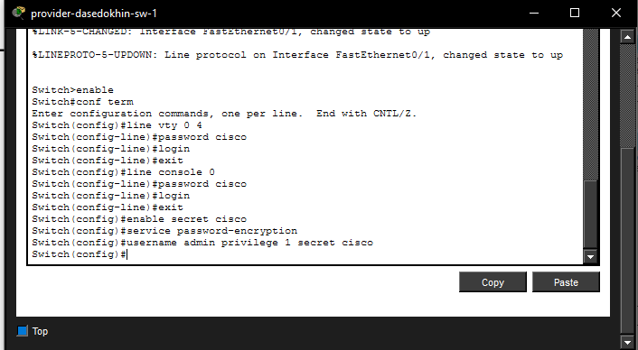
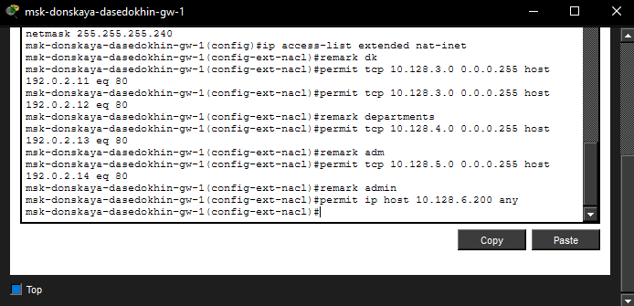
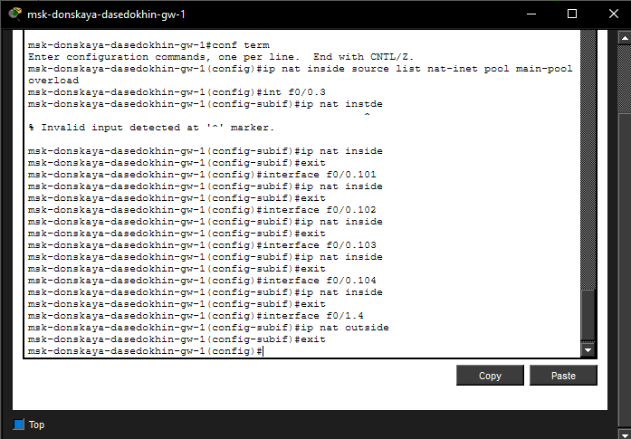
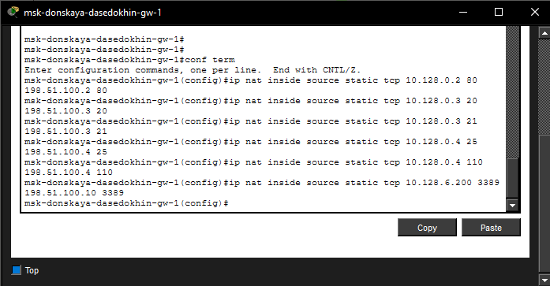
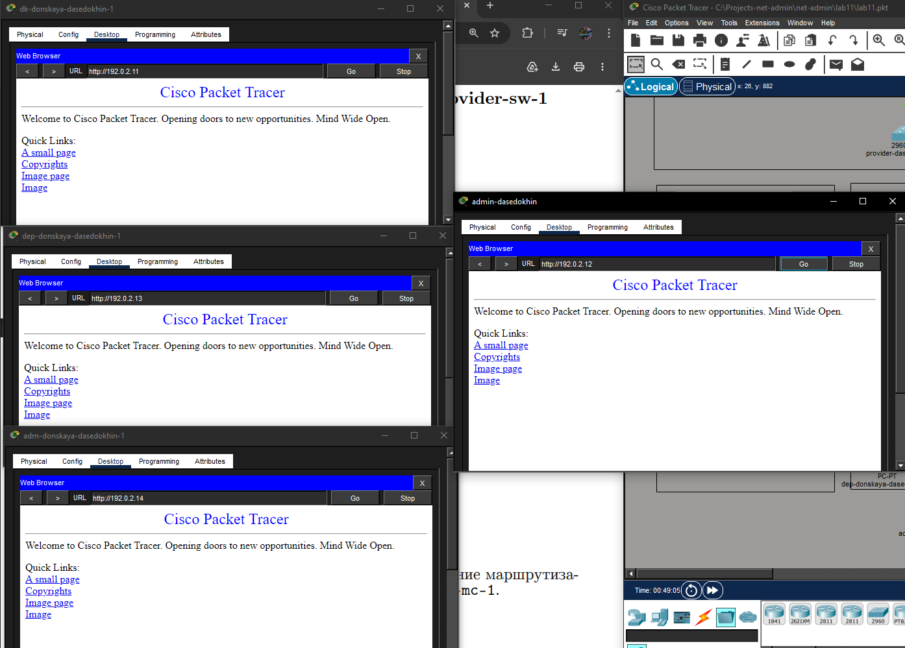

---
## Author
author:
  name: Седохин Даниил Алеквсеевич

## Title
title: "Лабораторная работа"
subtitle: "Номер 12"
license: "CC BY"
---

# Цель работы

Провести подготовительную работу по первоначальной настройке коммутаторов сети

# Выполнение лабораторной работы

Первоначальная настройка маршрутизатора

provider-gw-1

provider −gw−1>enable

provider −gw −1#configure terminal

provider −gw −1(config)#line vty 0 4

provider −gw −1(config −line)#password cisco

provider −gw −1(config −line)#login

provider −gw −1(config −line)#exit

provider −gw −1(config)#line console 0

provider −gw −1(config −line)#password cisco

provider −gw −1(config −line)#login

provider −gw −1(config −line)#exit

provider −gw −1(config)#enable secret cisco

provider −gw −1(config)#service password −encryption

provider −gw −1(config)#username admin privilege 1 secret cisco (рис. [-@fig-001]).

{#fig-001}

Первоначальная настройка коммутатора provider-sw-1

provider −sw−1>enable

provider −sw −1#configure terminal

provider −sw −1(config)#line vty 0 4

provider −sw −1(config −line)#password cisco

provider −sw −1(config −line)#login

provider −sw −1(config −line)#exit

provider −sw −1(config)#line console 0

provider −sw −1(config −line)#password cisco

provider −sw −1(config −line)#login

provider −sw −1(config −line)#exit

provider −sw −1(config)#enable secret cisco

provider −sw −1(config)#service password −encryption

provider −sw −1(config)#username admin privilege 1 secret cisco (рис. [-@fig-002]).

{#fig-002}

Настройка интерфейсов маршрутизатора provider-gw-1

provider −gw−1>enable

provider −gw −1#configure terminal

provider −gw −1(config)#interface f0/0

provider −gw −1(config −if)#no shutdown

provider −gw −1(config −if)#exit

provider −gw −1(config)#interface f0/0.4

provider −gw −1(config −subif)#encapsulation dot1Q 4

provider −gw −1(config −subif)#ip address 198.51.100.1 255.255.255.240

provider −gw −1(config −subif)#description mks−donskaya

provider −gw −1(config −subif)#exit

provider −gw −1(config)#interface f0/1

provider −gw −1(config −if)#no shutdown

provider −gw −1(config −if)#ip address 192.0.2.1 255.255.255.0

provider −gw −1(config −if)#description internet

provider −gw −1(config −if)#exit

provider −gw −1(config)#exit (рис. [-@fig-003]).

{#fig-003}

Настройка интерфейсов коммутатора provider-sw-1

provider −sw−1>enable

provider −sw −1#configure terminal

provider −sw −1(config)#interface f0/1

provider −sw −1(config −if)#switchport mode trunk

provider −sw −1(config −if)#exit

provider −sw −1(config)#interface f0/2

provider −sw −1(config −if)#switchport mode trunk

provider −sw −1(config −if)#exit

provider −sw −1(config)#vlan 4

provider −sw −1(config −vlan)#name nat

provider −sw −1(config −vlan)#exit

provider −sw −1(config)#interface vlan4

provider −sw −1(config −if)#no shutdown

provider −sw −1(config −if)#exit (рис. [-@fig-004]).

{#fig-004}

Настройка интерфейсов маршрутизатора msk-donskaya-gw-1

msk−donskaya −gw−1>enable

msk−donskaya −gw −1#configure terminal

msk−donskaya −gw −1(config)#interface f0/1

msk−donskaya −gw −1(config −if)#no shutdown

msk−donskaya −gw −1(config −if)#exit

msk−donskaya −gw −1(config)#interface f0/1.4

msk−donskaya −gw −1(config −subif)#encapsulation dot1Q 4

msk−donskaya −gw −1(config −subif)#ip address 198.51.100.2 255.255.255.240

msk−donskaya −gw −1(config −subif)#description internet

msk−donskaya −gw −1(config −subif)#exit

msk−donskaya −gw −1(config)#exit

msk−donskaya −gw−1>enable

msk−donskaya −gw −1#configure terminal

msk−donskaya −gw −1(config)#ip route 0.0.0.0 0.0.0.0 198.51.100.1

msk−donskaya −gw −1(config)#exit
(рис.
[-@fig-005]).

{#fig-005}

Настройка пула адресов для NAT

msk−donskaya −gw−1>enable

msk−donskaya −gw −1#configure terminal

msk−donskaya −gw −1(config)#ip nat pool main −pool 198.51.100.2 198.51.100.14 netmask 255.255.255.240
(рис. [-@fig-006]).

{#fig-006}

Настройка списка доступа для NAT

msk−donskaya −gw−1>enable

msk−donskaya −gw −1#configure terminal

msk−donskaya −gw −1(config)#ip access −list extended nat−inet

Сеть дисплейных классов

Хосты из сети дисплейных классов имеют доступ только к сайтам,

необходимым для учёбы (www.yandex.ru (192.0.2.11), stud.rudn.university
(192.0.2.12)).

msk−donskaya −gw −1(config −ext−nacl)#remark dk

msk−donskaya −gw −1(config −ext−nacl)#permit tcp 10.128.3.0 0.0.0.255 host 192.0.2.11 eq 80

msk−donskaya −gw −1(config −ext−nacl)#permit tcp 10.128.3.0 0.0.0.255 host 192.0.2.12 eq 80

Сеть кафедр

Сеть кафедр работает только с образовательными сайтами (esystem.pfur.

ru (192.0.2.13)).

msk−donskaya −gw −1(config −ext−nacl)#remark departments

msk−donskaya −gw −1(config −ext−nacl)#permit tcp 10.128.4.0 0.0.0.255 host 192.0.2.13 eq 80

Сеть администрации

Сеть администрации имеет возможность работать только с сайтом университета (www.rudn.ru (192.0.2.
14)).

msk−donskaya −gw −1(config −ext−nacl)#remark adm

msk−donskaya −gw −1(config −ext−nacl)#permit tcp 10.128.5.0 0.0.0.255 host 192.0.2.14 eq 80

Доступ для компьютера администратора

В сети для других пользователей компьютер администратора имеет полный
доступ в Интернет. Другие не имеют доступа.

msk−donskaya −gw −1(config −ext−nacl)#remark admin

msk−donskaya −gw −1(config −ext−nacl)#permit ip host 10.128.6.200 any
(рис. [-@fig-007]).

{#fig-006}

Настройка NAT

Настроить Port Address Translation (PAT)1

msk−donskaya −gw−1>enable

msk−donskaya −gw −1#configure terminal

msk−donskaya −gw −1(config)#ip nat inside source list nat−inet pool main −pool overload

Настройка интерфейсов для NAT:

msk−donskaya −gw −1(config)#int f0/0.3

msk−donskaya −gw −1(config −subif)#ip nat inside

msk−donskaya −gw −1(config)#interface f0/0.101

msk−donskaya −gw −1(config −subif)#ip nat inside

msk−donskaya −gw −1(config −subif)#exit

msk−donskaya −gw −1(config)#interface f0/0.102

msk−donskaya −gw −1(config −subif)#ip nat inside

msk−donskaya −gw −1(config −subif)#exit

msk−donskaya −gw −1(config)#interface f0/0.103

msk−donskaya −gw −1(config −subif)#ip nat inside

msk−donskaya −gw −1(config −subif)#exit

msk−donskaya −gw −1(config)#interface f0/0.104

msk−donskaya −gw −1(config −subif)#ip nat inside

msk−donskaya −gw −1(config −subif)#exit

msk−donskaya −gw −1(config)#interface f0/1.4

msk−donskaya −gw −1(config −subif)#ip nat outside

msk−donskaya −gw −1(config −subif)#exit
(рис. [-@fig-008]).

{#fig-006}

Настройка доступа из Интернета

WWW-сервер

msk−donskaya −gw −1(config)#ip nat inside source static tcp 10.128.0.2 80 198.51.100.2 80

Файловый сервер

msk−donskaya −gw −1(config)#ip nat inside source static tcp 10.128.0.3 20 198.51.100.3 20

msk−donskaya −gw −1(config)#ip nat inside source static tcp 10.128.0.3 21 198.51.100.3 21

Почтовый сервер

msk−donskaya −gw −1(config)#ip nat inside source static tcp 10.128.0.4 25 198.51.100.4 25

msk−donskaya −gw −1(config)#ip nat inside source static tcp 10.128.0.4 110 198.51.100.4 110

Доступ по RDP

msk−donskaya −gw −1(config)#ip nat inside source static tcp 10.128.6.200 3389 198.51.100.10 3389
(рис. [-@fig-009]).

{#fig-006}

Проверка работоспособности заданных настроек
(рис. [-@fig-010]).

{#fig-006}

# Выводы

В результате выполнения лабораторной работы были получены навыки настройки vlan в локальной сети из коммутаторов. Была осуществлена
первоначальная настройка сети
