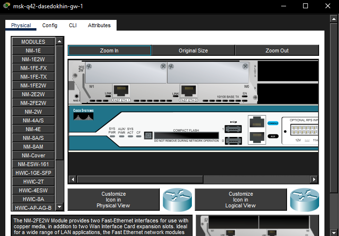
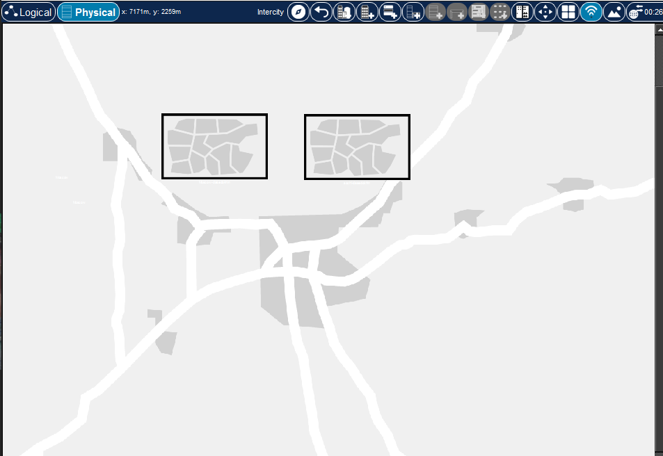
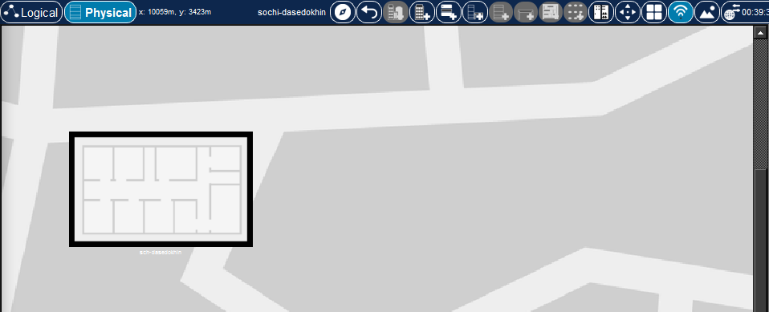
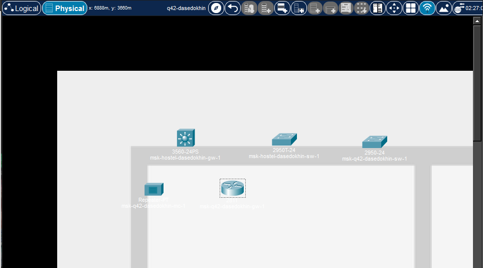

---
## Author
author:
  name: Седохин Даниил Алеквсеевич

## Title
title: "Лабораторная работа"
subtitle: "Номер 13"
license: "CC BY"
---

# Цель работы

Провести подготовительные мероприятия по организации взаимодействия
через сеть провайдера посредством статической маршрутизации локальной
сети с сетью основного здания, расположенного в 42-м квартале в Москве,
и сетью филиала, расположенного в г. Сочи.

# Выполнение лабораторной работы

На схеме предыдущего вашего проекта разместите согласно рис. 13.2 необходимое оборудование: 4 медиаконвертера (Repeater-PT), 2 маршрутизатора
типа Cisco 2811, 1 маршрутизирующий коммутатор типа Cisco 3560-24PS, 2
коммутатора типа Cisco 2950-24, коммутатор Cisco 2950-24T, 3 оконечных
устройства типа PC-PT.
(рис. [-@fig-001]).

{#fig-001}

На медиаконвертерах замените имеющиеся модули на PT-REPEATERNM-1FFE и PT-REPEATER-NM-1CFE для подключения витой пары по
технологии Fast Ethernet и оптоволокна соответственно
(рис. [-@fig-002]).

{#fig-002}

На маршрутизаторе msk-q42-gw-1 добавьте дополнительный интерфейс
NM-2FE2W
(рис. [-@fig-003]).

{#fig-003}

В физической рабочей области Packet Tracer добавьте в г. Москва здание
42-го квартала 
(рис. [-@fig-004]).

{#fig-004}

В физической рабочей области Packet Tracer добавьте город Сочи
(рис. [-@fig-005]).

{#fig-005}

В новом городе добавим здание филиала
(рис. [-@fig-006]).

{#fig-006}

Перенесем оборудование из сети донской в 42й квартал
(рис. [-@fig-007]).

{#fig-006}

Теперь перенесем оборудование из сети донской в сеть сочи
(рис. [-@fig-008]).

{#fig-006}

Теперь соединим все устройства
(рис. [-@fig-009]).

{#fig-006}

Первоначальная настройка маршрутизатора msk-q42-gw-1
(рис. [-@fig-010]).

{#fig-006}

Первоначальная настройка коммутатора msk-q42-sw-1
(рис. [-@fig-011]).

{#fig-006}

Первоначальная настройка маршрутизирующего коммутатора msk-hostel-gw-1
(рис. [-@fig-012]).

{#fig-006}

Первоначальная настройка коммутатора msk-hostel-sw-1
(рис. [-@fig-013]).

{#fig-006}

Первоначальная настройка коммутатора sch-sochi-sw-1
(рис. [-@fig-014]).

{#fig-006}

Первоначальная настройка маршрутизатора sch-sochi-gw-1
(рис. [-@fig-015]).

{#fig-006}

# Контрольные вопросы

Статическую маршрутизацию следует использовать в следующих случаях:

В небольших сетях, где количество маршрутов невелико и редко меняется (например, офис на 5–10 маршрутизаторов).

Для создания маршрута по умолчанию (default route) в сетях любого размера, чтобы направить весь неизвестный трафик к вышестоящему маршрутизатору.

Для обеспечения резервирования или управления конкретным трафиком, когда динамические протоколы нежелательны (например, «stub network»).

В ситуациях, где не требуется динамическое перестроение маршрутов при отказах, либо требуется полный контроль администратора.

Примеры:

Подключение филиала к головному офису через единственный линк (точка‑точка): ip route 192.168.2.0 255.255.255.0 10.0.0.2.

Маршрут по умолчанию к провайдеру: ip route 0.0.0.0 0.0.0.0 203.0.113.1.

Суммарный маршрут для нескольких подсетей: ip route 10.0.0.0 255.255.252.0 192.168.1.1.

Основные принципы статической маршрутизации между VLAN:

Используется многослойный коммутатор (Layer 3 Switch) или маршрутизатор с поддержкой сабинтерфейсов (Router‑on‑a‑stick).

Каждой VLAN выделяется отдельный логический интерфейс (SVI на коммутаторе или подынтерфейс на маршрутизаторе) с IP-адресом — этот адрес служит шлюзом по умолчанию для устройств в VLAN.

Маршруты между VLAN прописываются как статические на каждом L3-устройстве (если они распределены по разным устройствам). Если все VLAN находятся на одном многослойном коммутаторе, статические маршруты не требуются — коммутатор сам пересылает пакеты через SVI.

Для связи VLAN, расположенных на разных коммутаторах, указываются статические маршруты: ip route сеть_VLAN_B маска IP-адрес_соседа.

Необходимо включить IP‑маршрутизацию командой ip routing.

Статические маршруты требуют ручного сопровождения: при добавлении, изменении или удалении VLAN администратор должен обновить соответствующие маршруты.

# Выводы

Я провел подготовительные мероприятия по организации взаимодействия
через сеть провайдера посредством статической маршрутизации локальной
сети с сетью основного здания, расположенного в 42-м квартале в Москве,
и сетью филиала, расположенного в г. Сочи.
