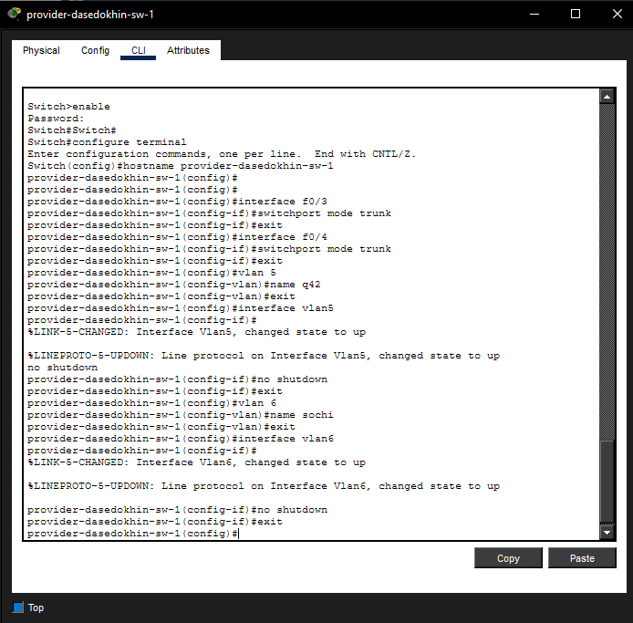
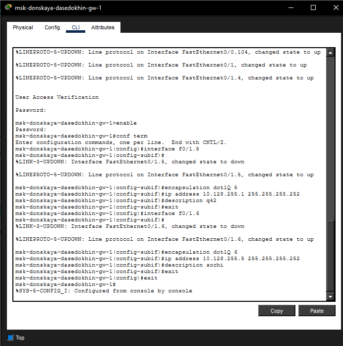
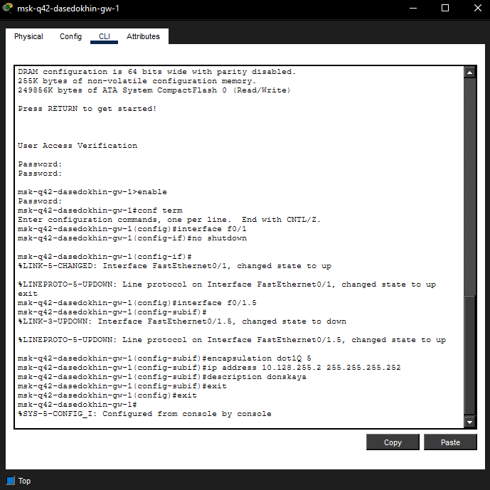
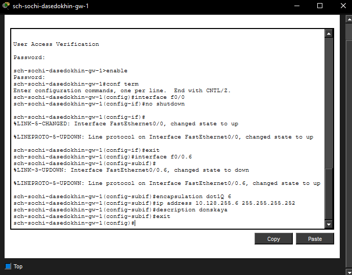
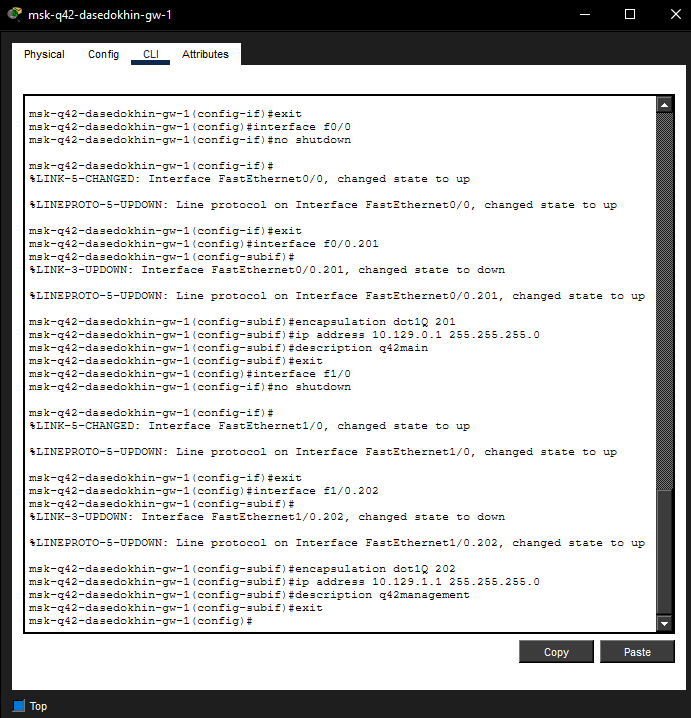
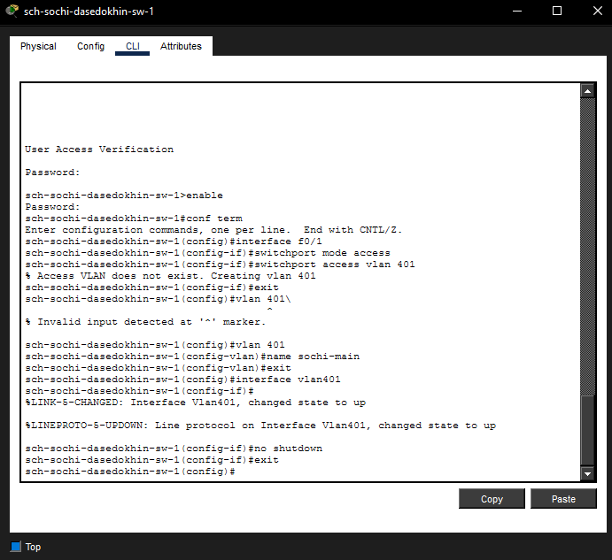
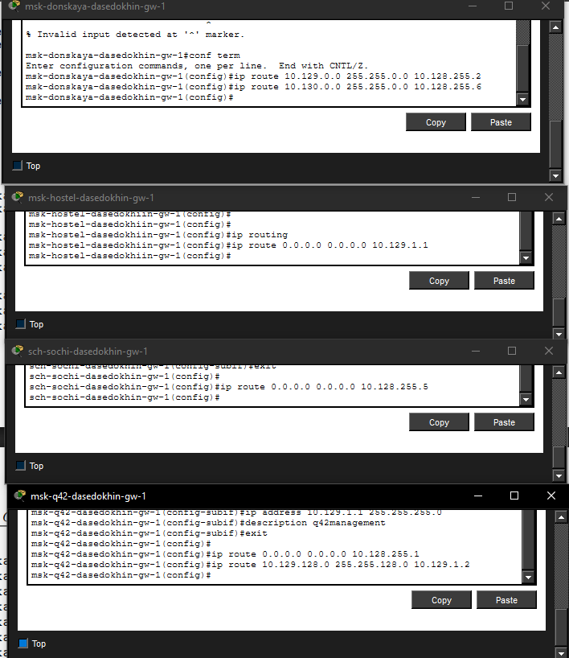

---
## Author
author:
  name: Седохин Даниил Алеквсеевич

## Title
title: "Лабораторная работа"
subtitle: "Номер 14"
license: "CC BY"
---

# Цель работы

Настроить взаимодействие через сеть провайдера посредством статической
маршрутизации локальной сети организации с сетью основного здания, расположенного в 42-м квартале в Москве, и сетью филиала, расположенного
в г. Сочи.

# Выполнение лабораторной работы

Настройка интерфейсов коммутатора provider-sw-1

provider −sw−1>enable

provider −sw −1#configure terminal

provider −sw −1(config)#interface f0/3

provider −sw −1(config −if)#switchport mode trunk

provider −sw −1(config −if)#exit

provider −sw −1(config)#interface f0/4

provider −sw −1(config −if)#switchport mode trunk

provider −sw −1(config −if)#exit

provider −sw −1(config)#vlan 5

provider −sw −1(config −vlan)#name q42

provider −sw −1(config −vlan)#exit

provider −sw −1(config)#interface vlan5

provider −sw −1(config −if)#no shutdown

provider −sw −1(config −if)#exit

provider −sw −1(config)#vlan 6

provider −sw −1(config −vlan)#name sochi

provider −sw −1(config −vlan)#exit

provider −sw −1(config)#interface vlan6

provider −sw −1(config −if)#no shutdown

provider −sw −1(config −if)#exit
(рис. [-@fig-001]).

{#fig-001}

Настройка интерфейсов маршрутизатора msk-donskaya-gw-1

msk−donskaya −gw−1>enable

msk−donskaya −gw −1#configure terminal

msk−donskaya −gw −1(config)#interface f0/1.5

msk−donskaya −gw −1(config −subif)#encapsulation dot1Q 5

msk−donskaya −gw −1(config −subif)#ip address 10.128.255.1 255.255.255.252

msk−donskaya −gw −1(config −subif)#description q42

msk−donskaya −gw −1(config −subif)#exit

msk−donskaya −gw −1(config)#interface f0/1.6

msk−donskaya −gw −1(config −subif)#encapsulation dot1Q 6

msk−donskaya −gw −1(config −subif)#ip address 10.128.255.5 255.255.255.252

msk−donskaya −gw −1(config −subif)#description sochi

msk−donskaya −gw −1(config −subif)#exit

msk−donskaya −gw −1(config)#exit
(рис. [-@fig-002]).

{#fig-002}

Настройка интерфейсов маршрутизатора msk-q42-gw-1

msk−q42−gw−1>enable

msk−q42−gw −1#configure terminal

msk−q42−gw −1(config)#interface f0/1

msk−q42−gw −1(config −if)#no shutdown

msk−q42−gw −1(config −if)#exit

msk−q42−gw −1(config)#interface f0/1.5

msk−q42−gw −1(config −subif)#encapsulation dot1Q 5

msk−q42−gw −1(config −subif)#ip address 10.128.255.2 255.255.255.252

msk−q42−gw −1(config −subif)#description donskaya

msk−q42−gw −1(config −subif)#exit

msk−q42−gw −1(config)#exit
(рис. [-@fig-003]).

{#fig-003}

Настройка интерфейсов коммутатора sch-sochi-sw-1

sch−sochi −sw−1>enable

sch−sochi −sw −1#configure terminal

sch−sochi −sw −1(config)#interface f0/23

sch−sochi −sw −1(config −if)#switchport mode trunk

sch−sochi −sw −1(config −if)#exit

sch−sochi −sw −1(config)#interface f0/24

sch−sochi −sw −1(config −if)#switchport mode trunk

sch−sochi −sw −1(config −if)#exit

sch−sochi −sw −1(config)#vlan 6

sch−sochi −sw −1(config −vlan)#name sochi

sch−sochi −sw −1(config −vlan)#exit

sch−sochi −sw −1(config)#interface vlan6

sch−sochi −sw −1(config −if)#no shutdown

sch−sochi −sw −1(config −if)#exit
(рис. [-@fig-004]).

{#fig-004}

Настройка интерфейсов маршрутизатора sch-sochi-gw-1

sch−sochi −gw−1>enable

sch−sochi −gw −1#configure terminal

sch−sochi −gw −1(config)#interface f0/0

sch−sochi −gw −1(config −if)#no shutdown

sch−sochi −gw −1(config −if)#exit

sch−sochi −gw −1(config)#interface f0/0.6

sch−sochi −gw −1(config −subif)#encapsulation dot1Q 6

sch−sochi −gw −1(config −subif)#ip address 10.128.255.6 255.255.255.252

sch−sochi −gw −1(config −subif)#description donskaya

sch−sochi −gw −1(config −subif)#exit

sch−sochi −gw −1(config)#exit
(рис. [-@fig-005]).

{#fig-005}

Настройка интерфейсов маршрутизатора msk-q42-gw-1

msk−q42−gw−1>enable

msk−q42−gw −1#configure terminal

msk−q42−gw −1(config)#interface f0/0

msk−q42−gw −1(config −if)#no shutdown

msk−q42−gw −1(config −if)#exit

msk−q42−gw −1(config)#interface f0/0.201

msk−q42−gw −1(config −subif)#encapsulation dot1Q 201

msk−q42−gw −1(config −subif)#ip address 10.129.0.1 255.255.255.0

msk−q42−gw −1(config −subif)#description q42−main

msk−q42−gw −1(config −subif)#exit

msk−q42−gw −1(config)#interface f1/0

msk−q42−gw −1(config −if)#no shutdown

msk−q42−gw −1(config −if)#exit

msk−q42−gw −1(config)#interface f1/0.202

msk−q42−gw −1(config −subif)#encapsulation dot1Q 202

msk−q42−gw −1(config −subif)#ip address 10.129.1.1 255.255.255.0

msk−q42−gw −1(config −subif)#description q42−management

msk−q42−gw −1(config −subif)#exit
(рис. [-@fig-006]).

{#fig-006}

Настройка интерфейсов коммутатора msk-q42-sw-1

msk−q42−sw−1>enable

msk−q42−sw −1#configure terminal

msk−q42−sw −1(config)#interface f0/24

msk−q42−sw −1(config −if)#switchport mode trunk

msk−q42−sw −1(config −if)#exit

msk−q42−sw −1(config)#interface f0/1

msk−q42−sw −1(config −if)#switchport mode access

msk−q42−sw −1(config −if)#switchport access vlan 201

msk−q42−sw −1(config −if)#exit

msk−q42−sw −1(config)#vlan 201

msk−q42−sw −1(config −vlan)#name q42−main

msk−q42−sw −1(config −vlan)#exit

msk−q42−sw −1(config)#interface vlan201

msk−q42−sw −1(config −if)#no shutdown

msk−q42−sw −1(config −if)#exit
(рис. [-@fig-007]).

{#fig-006}

Настройка интерфейсов маршрутизирующего коммутатора

msk-hostel-gw-1

msk−hostel −gw−1>enable

msk−hostel −gw −1#configure terminal

msk−hostel −gw −1(config)#interface g0/1

msk−hostel −gw −1(config −if)#switchport trunk encapsulation dot1q

msk−hostel −gw −1(config −if)#switchport mode trunk

msk−hostel −gw −1(config −if)#exit

msk−hostel −gw −1(config)#interface f0/1

msk−hostel −gw −1(config −if)#switchport trunk encapsulation dot1q

msk−hostel −gw −1(config −if)#switchport mode trunk

msk−hostel −gw −1(config −if)#exit

msk−hostel −gw −1(config)#vlan 202

msk−hostel −gw −1(config −vlan)#name q42−management

msk−hostel −gw −1(config −vlan)#exit

msk−hostel −gw −1(config)#interface vlan202

msk−hostel −gw −1(config −if)#no shutdown

msk−hostel −gw −1(config −if)#ip address 10.129.1.2 255.255.255.0

msk−hostel −gw −1(config −if)#exit

msk−hostel −gw −1(config)#vlan 301

msk−hostel −gw −1(config −vlan)#name hostel −main

msk−hostel −gw −1(config −vlan)#exit

msk−hostel −gw −1(config)#interface vlan301

msk−hostel −gw −1(config −if)#no shutdown

msk−hostel −gw −1(config −if)#ip address 10.129.128.1 255.255.255.0

msk−hostel −gw −1(config −if)#exit
(рис. [-@fig-008]).

{#fig-006}

Настройка интерфейсов коммутатора msk-hostel-sw-1

msk−hostel −sw−1>enable

msk−hostel −sw −1#configure terminal

msk−hostel −sw −1(config)#interface g0/1

msk−hostel −sw −1(config −if)#switchport mode trunk

msk−hostel −sw −1(config −if)#exit

msk−hostel −sw −1(config)#interface f0/1

msk−hostel −sw −1(config −if)#switchport mode access

msk−hostel −sw −1(config −if)#switchport access vlan 301

msk−hostel −sw −1(config −if)#exit

msk−hostel −sw −1(config)#vlan 301

msk−hostel −sw −1(config −vlan)#name hostel −main

msk−hostel −sw −1(config −vlan)#exit

msk−hostel −sw −1(config)#interface vlan301

msk−hostel −sw −1(config −if)#no shutdown

msk−hostel −sw −1(config −if)#exit
(рис. [-@fig-009]).

{#fig-006}

Настройка интерфейсов маршрутизатора sch-sochi-gw-1

sch−sochi −gw−1>enable

sch−sochi −gw −1#configure terminal

sch−sochi −gw −1(config)#interface f0/0.401

sch−sochi −gw −1(config −subif)#encapsulation dot1Q 401

sch−sochi −gw −1(config −subif)#ip address 10.130.0.1 255.255.255.0

sch−sochi −gw −1(config −subif)#description sochi −main

sch−sochi −gw −1(config −subif)#exit

sch−sochi −gw −1(config)#interface f0/0.402

sch−sochi −gw −1(config −subif)#encapsulation dot1Q 402

sch−sochi −gw −1(config −subif)#ip address 10.130.1.1 255.255.255.0

sch−sochi −gw −1(config −subif)#description sochi −management

sch−sochi −gw −1(config −subif)#exit
(рис. [-@fig-010]).

{#fig-006}

Настройка интерфейсов коммутатора sch-sochi-sw-1

sch−sochi −sw−1>enable

sch−sochi −sw −1#configure terminal

sch−sochi −sw −1(config)#interface f0/1

sch−sochi −sw −1(config −if)#switchport mode access

sch−sochi −sw −1(config −if)#switchport access vlan 401

sch−sochi −sw −1(config −if)#exit

sch−sochi −sw −1(config)#vlan 401

sch−sochi −sw −1(config −vlan)#name sochi −main

sch−sochi −sw −1(config −vlan)#exit

sch−sochi −sw −1(config)#interface vlan401

sch−sochi −sw −1(config −if)#no shutdown

sch−sochi −sw −1(config −if)#exit
(рис. [-@fig-011]).

{#fig-006}

Настройка маршрутизатора msk-donskaya-gw-1

Статическая маршрутизация в Интернете. Настройка

msk−donskaya −gw−1>enable

msk−donskaya −gw −1#configure terminal

msk−donskaya −gw −1(config)#ip route 10.129.0.0 255.255.0.0 10.128.255.2

msk−donskaya −gw −1(config)#ip route 10.130.0.0 255.255.0.0 10.128.255.6

Настройка маршрутизатора msk-q42-gw-1

msk−q42−gw−1>enable

msk−q42−gw −1#configure terminal

msk−q42−gw −1(config)#ip route 0.0.0.0 0.0.0.0 10.128.255.1

Настройка маршрутизатора sch-sochi-gw-1

sch−sochi −gw−1>enable

sch−sochi −gw −1#configure terminal

sch−sochi −gw −1(config)#ip route 0.0.0.0 0.0.0.0 10.128.255.5

Настройка маршрутизатора msk-q42-gw-1

msk−q42−gw−1>enable

msk−q42−gw −1#configure terminal

msk−q42−gw −1(config)#ip route 10.129.128.0 255.255.128.0 10.129.1.2

Настройка интерфейсов маршрутизирующего коммутатора

msk-hostel-gw-1

msk−hostel −gw−1>enable

msk−hostel −gw −1#configure terminal

msk−hostel −gw −1(config)#ip routing

msk−hostel −gw −1(config)#ip route 0.0.0.0 0.0.0.0 10.129.1.1
(рис. [-@fig-012]).

{#fig-006}

Настройка NAT на маршрутизаторе msk-donskaya-gw-1

msk−donskaya −gw−1>enable

msk−donskaya −gw −1#configure terminal

msk−donskaya −gw −1(config)#interface f0/1.5

msk−donskaya −gw −1(config −subif)#ip nat inside

msk−donskaya −gw −1(config −subif)#exit

msk−donskaya −gw −1(config)#interface f0/1.6

msk−donskaya −gw −1(config −subif)#ip nat inside

msk−donskaya −gw −1(config −subif)#exit

msk−donskaya −gw −1(config)#ip access −list extended nat−inet

msk−donskaya −gw −1(config −ext−nacl)#remark q42

msk−donskaya −gw −1(config −ext−nacl)#permit ip host 10.129.0.200 any

msk−donskaya −gw −1(config −ext−nacl)#permit ip host 10.129.128.200 any

msk−donskaya −gw −1(config −ext−nacl)#remark sochi

msk−donskaya −gw −1(config −ext−nacl)#permit ip host 10.130.0.200 any

msk−donskaya −gw −1(config −ext−nacl)#exit
(рис. [-@fig-013]).

{#fig-006}

# Контрольные вопросы

Пример настройки статической маршрутизации между двумя подсетями организации
Предположим, есть два маршрутизатора: R1 (подсеть 192.168.1.0/24, интерфейс Gig0/0 — 192.168.1.1) и R2 (подсеть 192.168.2.0/24, интерфейс Gig0/0 — 192.168.2.1). Они соединены через интерфейсы Gig0/1 с адресами 10.0.0.1 и 10.0.0.2 соответственно.
На R1 добавляется статический маршрут до сети 192.168.2.0/24:
ip route 192.168.2.0 255.255.255.0 10.0.0.2
На R2 добавляется маршрут до сети 192.168.1.0/24:
ip route 192.168.1.0 255.255.255.0 10.0.0.1

Процесс обращения устройства из одного VLAN к устройству из другого VLAN
Устройство из VLAN 10 отправляет IP-пакет устройству из VLAN 20. Поскольку они в разных подсетях, отправитель определяет, что получатель не в его локальной сети, и отправляет кадр на свой шлюз по умолчанию (обычно IP-адрес интерфейса маршрутизатора в VLAN 10). Кадр поступает на маршрутизатор (или многоуровневый коммутатор), который удаляет заголовок канала, смотрит на IP-адрес назначения, находит в таблице маршрутизации, что сеть назначения связана с VLAN 20, и пересылает пакет через соответствующий интерфейс в VLAN 20. Затем устройство в VLAN 20 получает кадр от маршрутизатора.

Как проверить работоспособность маршрута
Используется команда ping для проверки связности с удаленным устройством в сети назначения. Также можно применить traceroute (или tracert в Windows), чтобы увидеть путь следования пакетов и убедиться, что маршрут проходит через нужные маршрутизаторы. В маршрутизаторах и коммутаторах уровня L3 также полезно использовать команду show ip route для проверки наличия маршрута и его статуса.

Как посмотреть таблицу маршрутизации
В операционных системах семейства Windows — команда route print или netstat -r. В Linux — ip route show или route -n. На сетевом оборудовании (Cisco, Juniper и др.) — в привилегированном режиме: show ip route (для IPv4) или show ipv6 route (для IPv6).

# Выводы

Я настроил взаимодействие через сеть провайдера посредством статической
маршрутизации локальной сети организации с сетью основного здания, расположенного в 42-м квартале в Москве, и сетью филиала, расположенного
в г. Сочи.