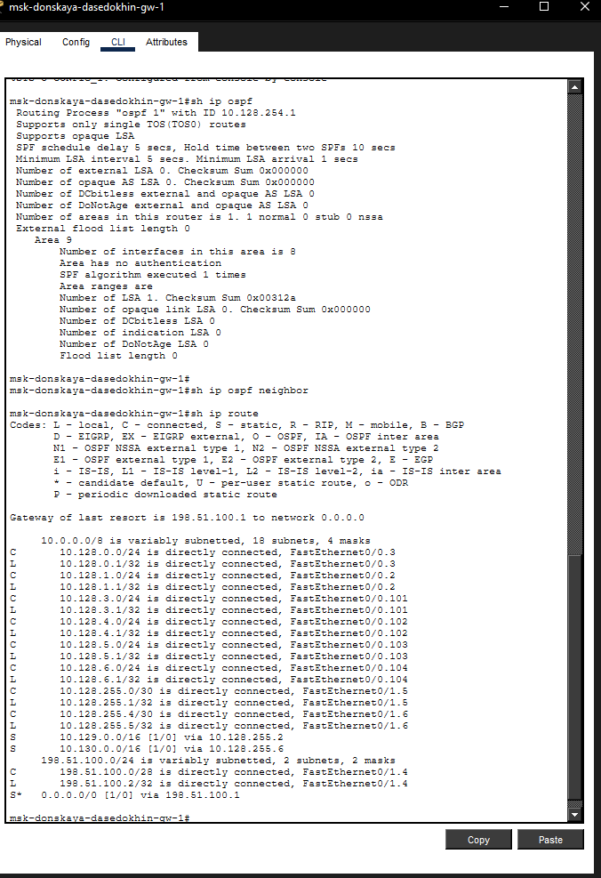
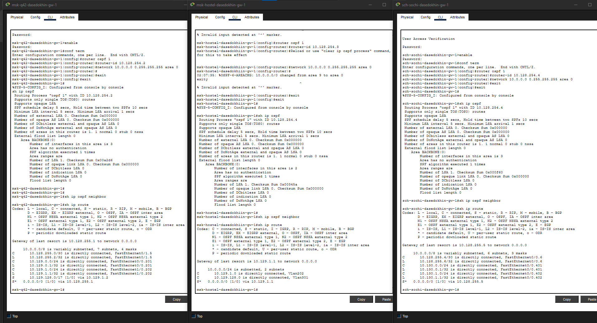
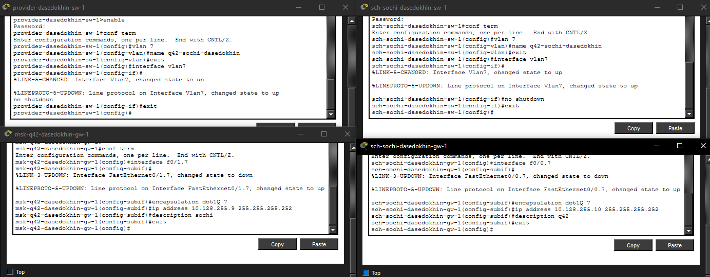

  ---
## Author
author:
  name: Седохин Даниил Алеквсеевич

## Title
title: "Лабораторная работа"
subtitle: "Номер 15"
license: "CC BY"
---

# Цель работы

Настроить динамическую маршрутизацию между территориями организации.

# Выполнение лабораторной работы

Настройка маршрутизатора msk-donskaya-gw-1

Включение OSPF на маршрутизаторе предполагает, во-первых,
включение процесса OSPF командой router ospf <process-id>, вовторых — назначение областей (зон) интерфейсам с помощью команды
network <network or IP address> <mask> area <area-id>:

msk−donskaya −gw−1>enable

msk−donskaya −gw −1#configure terminal

msk−donskaya −gw −1(config)#router ospf 1

msk−donskaya −gw −1(config −router)#router −id 10.128.254.1

msk−donskaya −gw −1(config −router)#network 10.0.0.0 0.255.255.255 area 0

msk−donskaya −gw −1(config −router)#exit

Идентификатор процесса OSPF (process-id) по сути идентифицирует маршрутизатор в автономной системе, и, вообще говоря, он не должен совпадать
с идентификаторами процессов на других маршрутизаторах.
(рис. [-@fig-001]).

{#fig-001}

Проверка состояния протокола OSPF на маршрутизаторе

msk-donskaya-gw-1

msk−donskaya −gw−1>enable

msk−donskaya −gw −1#sh ip ospf

msk−donskaya −gw −1#sh ip ospf neighbor

msk−donskaya −gw −1#sh ip route

Маршрутизаторы с общим сегментом являются соседями в этом
сегменте. Соседи выбираются с помощью протокола Hello. Команда
show ip ospf neighbor показывает статус всех соседей в заданном сегменте.
Команда show ip ospf route (или show ip route) выводит информацию из
таблицы маршрутизации.
(рис. [-@fig-002]).

{#fig-002}

Настройка маршрутизатора msk-q42-gw-1

msk−q42−gw−1>enable

msk−q42−gw −1#configure terminal

msk−q42−gw −1(config)#router ospf 1

msk−q42−gw −1(config −router)#router −id 10.128.254.2

msk−q42−gw −1(config −router)#network 10.0.0.0 0.255.255.255 area 0

msk−q42−gw −1(config −router)#exit

15.4.1.4. Настройка маршрутизирующего коммутатора

msk-hostel-gw-1

msk−hostel −gw−1>enable

msk−hostel −gw −1#configure terminal

msk−hostel −gw −1(config)#router ospf 1

msk−hostel −gw −1(config −router)#router −id 10.128.254.3

msk−hostel −gw −1(config −router)#network 10.0.0.0 0.255.255.255 area 0

msk−hostel −gw −1(config −router)#exit

15.4.1.5. Настройка маршрутизатора sch-sochi-gw-1

sch−sochi −gw−1>enable

sch−sochi −gw −1#configure terminal

sch−sochi −gw −1(config)#router ospf 1

sch−sochi −gw −1(config −router)#router −id 10.128.254.4

sch−sochi −gw −1(config −router)#network 10.0.0.0 0.255.255.255 area 0

sch−sochi −gw −1(config −router)#exit

Проверьте состояние протокола OSPF на всех маршрутизаторах. Что можно
сказать о соседях OSPF на разных маршрутизаторах? Что можно сказать
о маршрутных таблицах на разных маршрутизаторах?
(рис. [-@fig-003]).

{#fig-003}

Настройка линка 42-й квартал–Сочи

15.4.2.1. Настройка интерфейсов коммутатора provider-sw-1

provider −sw−1>enable

provider −sw −1#configure terminal

provider −sw −1(config)#vlan 7

provider −sw −1(config −vlan)#name q42−sochi

provider −sw −1(config −vlan)#exit

provider −sw −1(config)#interface vlan7

provider −sw −1(config −if)#no shutdown

provider −sw −1(config −if)#exit

15.4.2.2. Настройка маршрутизатора msk-q42-gw-1

msk−q42−gw−1>enable

msk−q42−gw −1#configure terminal

msk−q42−gw −1(config)#interface f0/1.7

msk−q42−gw −1(config −subif)#encapsulation dot1Q 7

msk−q42−gw −1(config −subif)#ip address 10.128.255.9 255.255.255.252

msk−q42−gw −1(config −subif)#description sochi

msk−q42−gw −1(config −subif)#exit

15.4.2.3. Настройка коммутатора sch-sochi-sw-1

sch−sochi −sw−1>enable

sch−sochi −sw −1#configure terminal

sch−sochi −sw −1(config)#vlan 7

sch−sochi −sw −1(config −vlan)#name q42−sochi

sch−sochi −sw −1(config −vlan)#exit

sch−sochi −sw −1(config)#interface vlan7

sch−sochi −sw −1(config −if)#no shutdown

sch−sochi −sw −1(config −if)#exit

15.4.2.4. Настройка маршрутизатора sch-sochi-gw-1

sch−sochi −gw−1>enable

sch−sochi −gw −1#configure terminal

sch−sochi −gw −1(config)#interface f0/0.7

sch−sochi −gw −1(config −subif)#encapsulation dot1Q 7

sch−sochi −gw −1(config −subif)#ip address 10.128.255.10 255.255.255.252

sch−sochi −gw −1(config −subif)#description q42

sch−sochi −gw −1(config −subif)#exit
(рис. [-@fig-004]).

{#fig-004}

# Контрольные вопросы

Какие протоколы относятся к протоколам динамической маршрутизации?
К протоколам динамической маршрутизации относятся: RIP (Routing Information Protocol), OSPF (Open Shortest Path First), EIGRP (Enhanced Interior Gateway Routing Protocol), IS-IS (Intermediate System to Intermediate System), BGP (Border Gateway Protocol). Они делятся на внутренние (IGP) для использования внутри автономной системы (RIP, OSPF, EIGRP, IS-IS) и внешние (EGP) для обмена маршрутной информацией между автономными системами (BGP).

Охарактеризуйте принципы работы протоколов динамической маршрутизации.
Протоколы динамической маршрутизации автоматически обнаруживают изменения в топологии сети, обмениваются маршрутной информацией между соседними маршрутизаторами и строят таблицы маршрутизации на основе полученных данных. Они используют алгоритмы для вычисления наилучших путей: дистанционно-векторные (RIP) — обмен векторами расстояний до сетей, протоколы состояния каналов (OSPF, IS-IS) — построение полной карты сети с помощью алгоритма Дейкстры для нахождения кратчайшего пути, а также гибридные (EIGRP). При изменении топологии (отказ/восстановление линка) протоколы перестраивают маршруты, обеспечивая отказоустойчивость.

Опишите процесс обращения устройства из одной подсети к устройству из другой подсети по протоколу динамической маршрутизации.
Устройство-источник определяет, что получатель находится в другой подсети, и отправляет IP-пакет на свой шлюз по умолчанию (маршрутизатор). Маршрутизатор, получив пакет, проверяет таблицу маршрутизации, построенную протоколом динамической маршрутизации (например, OSPF), находит наилучший путь к сети назначения и определяет следующий hop (соседний маршрутизатор) и исходящий интерфейс. Маршрутизатор изменяет MAC-адрес назначения на MAC-адрес следующего hop’а и пересылает пакет. Процесс повторяется на каждом маршрутизаторе вдоль маршрута, пока пакет не достигнет маршрутизатора, непосредственно подключённого к сети получателя, который доставит пакет конечному устройству.

Опишите выводимую информацию при просмотре таблицы маршрутизации.
Команда show ip route выводит таблицу маршрутизации, которая содержит следующие поля:

Источник маршрута (код) — буквенное обозначение способа изучения маршрута: C (connected) — подключён напрямую, S (static) — статический, O (OSPF), R (RIP), D (EIGRP), B (BGP), S* (маршрут по умолчанию).

Сеть назначения — IP-адрес и маска подсети, к которой ведёт маршрут.

Административная дистанция — степень доверия протоколу (чем меньше, тем приоритетнее).

Метрика — стоимость маршрута (например, количество хопов для RIP или суммарная стоимость для OSPF).

Следующий hop — IP-адрес соседнего маршрутизатора, которому нужно передать пакет.

Исходящий интерфейс — физический или логический интерфейс, через который отправляется пакет. Также может отображаться маршрут по умолчанию (0.0.0.0/0) для трафика, не имеющего явного соответствия в таблице.

# Выводы

Я Настроил динамическую маршрутизацию между территориями организации.